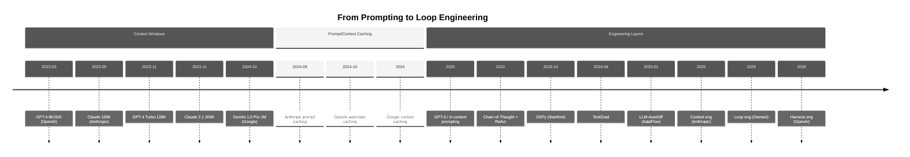
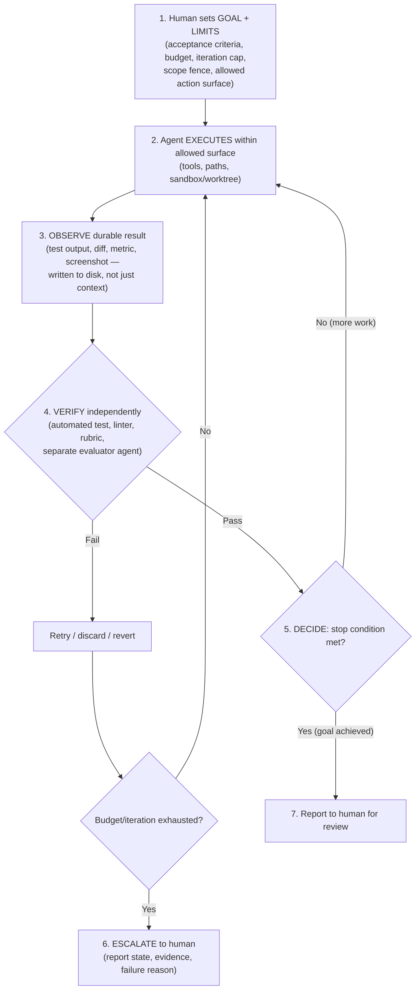

# Loop Engineering For Everyone — Comprehensive Reference

> **Format:** Comprehensive reference document (~8000 words). A concise 30-minute class can be extracted using the map in [Part 12](#part-12-how-to-extract-the-30-minute-class).  
> **Audience:** Developers who have used an AI coding agent at least once.  
> **Prerequisites:** Basic familiarity with LLM-based tools (Copilot, Claude Code, Cursor, or similar).

---

## Part 1: The Research Bridge — From Optimization to Engineering

I'm Li Yin, creator of [AdalFlow](https://github.com/SylphAI-Inc/AdalFlow) and founder of [AdaL](https://adal.sylph.ai). My research background is in optimizing LLM workflows through feedback signals — and that's exactly what this document is about, at a different scale.

In January 2025, we published *LLM-AutoDiff: Auto-Differentiate Any LLM Workflow* ([Yin et al., 2025](https://arxiv.org/abs/2501.16673)). The core contribution: prompts and workflow components can be treated as **optimizable parameters**. A backward-engine LLM produces textual feedback — analogous to gradients — that iteratively improves multi-component pipelines. This is implemented in the AdalFlow library.

**The design lineage to AdaL Engineer:** If a feedback loop can optimize a *prompt*, the same structural principle — observe output, generate feedback, improve, repeat — can optimize an *entire engineering workflow*. The feedback signal doesn't have to be a textual gradient. It can be a test result, a screenshot comparison, a linter output, or a human approval.

**Important boundary:** LLM-AutoDiff is research and library work. AdaL Engineer does not run textual gradients as its production runtime. The connection is a design lineage: feedback signals and iterative improvement moved from optimizing workflow components to engineering reliable task loops.

---

## Part 2: The Problem — Babysitting Agents

You open your terminal. You type a prompt. The agent responds. You review. You correct. You prompt again. You review again.

You are the glue holding the loop together.

This works for a single task. It does not work when you need to:

- Clone a landing page pixel-perfectly (50+ iterations of screenshot → compare → fix).
- Fix a bug that requires researching 12 files, editing 3, running tests, and verifying no regressions.
- Generate, test, and review a multi-file feature across frontend and backend.

In each case, the *pattern* is the same: goal → action → check → decide → repeat. But YOU are manually driving every cycle. Your attention is the bottleneck.

**The shift:** Instead of being the person who prompts the agent, you become the person who *designs the system that prompts the agent*.

---

## Part 3: The Four Layers

The center of gravity in AI keeps drifting away from the model itself.

> **Prompt engineering.** The words you send.  
> **Context engineering.** Everything the model sees, not just your instructions.  
> **Harness engineering.** The code around the model that runs tools, tracks state, and handles errors.  
> **Loop engineering.** The autonomous cycle that drives the whole thing toward a goal.

Each layer builds on the previous. Together they describe where an AI engineer's attention goes — and where it's heading.

### Prompt Engineering

The practice of crafting single instructions to elicit desired model behavior: few-shot examples, chain-of-thought, role assignment, output formatting.

Prompt engineering remains important — it did not "end." It became one layer among several. The 2022 ReAct paper ([Yao et al., 2022](https://arxiv.org/abs/2210.03629)) demonstrated that combining reasoning traces with tool-use actions within a single prompt could enable agents to interact with external environments — an early signal that prompting alone was insufficient for agentic work.

### Context Engineering

The discipline of curating the **full token state** the model sees at inference time — not just your prompt, but:

- System/developer instructions
- Tool definitions and contracts
- Tool outputs from previous steps
- Conversation and task history
- Retrieved documents (RAG, search results)
- Relevant runtime state (file contents, environment variables)

Anthropic's Applied AI team defines it as "the set of strategies for curating and maintaining the optimal set of tokens during LLM inference, including all the other information that may land there outside of the prompts" ([Anthropic, 2025](https://www.anthropic.com/engineering/effective-context-engineering-for-ai-agents)). The key insight: context is a **finite resource with diminishing returns** — every additional token depletes the model's attention budget.

### Harness Engineering

The practice of designing the **orchestration infrastructure** around the model — everything except the model itself:

- **Feedforward guides:** Rules, reference docs, skills, coding conventions — steer the agent *before* it acts
- **Feedback sensors:** Linters, tests, type checkers, review agents — help the agent self-correct *after* it acts
- Tool execution, permissions, and sandboxing
- State persistence and error recovery
- Logging, observability, and retries

A well-built harness serves two goals: it increases the probability that the agent gets it right in the first place, and it provides a feedback loop that self-corrects issues before they reach human eyes. The OpenAI Codex team describes this framing in their harness-engineering writeup ([OpenAI, 2026](https://openai.com/index/harness-engineering/)). This is evolving terminology — not yet a standardized academic field.

### Scaffolding

A **scaffold** is a supporting structure that helps a system accomplish work it could not yet reliably accomplish alone.

**Lineage.** The word has older construction usage in English (from Old French *eschafaut*): a temporary external framework erected around a building to support workers and materials, then dismantled when the permanent structure stands on its own. In education, Wood, Bruner, and Ross (1976) used "scaffolding" to discuss tutoring support during problem solving — how an adult structures a task so a child can succeed at it ([Wood, Bruner & Ross, 1976](https://acamh.onlinelibrary.wiley.com/doi/10.1111/j.1469-7610.1976.tb00381.x)). Later educational literature developed related ideas about calibrated support and progressive fading.

**In modern AI-agent systems,** the term is used broadly — there is no single canonical origin or universal technical definition. It typically refers to any supporting structure built around a model to make a particular task more reliable or tractable: task templates, tool wrappers, environment setup, reference documents, test commands, state files, evaluator checklists, retry rules, and stop conditions can all serve as scaffolding. Unlike the construction metaphor, agent scaffolding is not necessarily temporary — it can be a durable reliability and control structure that persists across the system's lifetime. One agent glossary distinguishes scaffolding as "what the model works *from*" versus the harness as "what makes the agent *run*" ([Paniego & Gosthipaty, 2025](https://huggingface.co/blog/agent-glossary)). Others — including Claude Code, Codex, and Cursor — use "harness" as an umbrella that subsumes scaffolding. This document uses "harness" in the umbrella sense (see Glossary) but acknowledges the finer-grained distinction.

**Distinguishing the layers:**

| Term | What it is |
|------|-----------|
| **Context** | The token payload the model sees at a given inference call |
| **Harness** | The runtime/orchestration code and system around the model (execution layer) |
| **Scaffolding** | Supporting structure that makes a particular task more reliable or tractable — can be built into a harness or supplied around it |
| **Loop** | The repeated action → observation/verification → decision cycle that drives toward a goal |

**AdaL example.** In AdaL Engineer, the task contract, builder/evaluator plans, validation commands (test gates, lint checks, screenshot comparisons), and disk-backed task records all function as scaffolding. They improve the reliability and inspectability of the agent's work — they do not improve the underlying model's intelligence.

### Loop Engineering

The practice of designing **repeatable, verifiable, agent-driven feedback loops**: goal → act → observe/verify → decide (repeat or stop) — with explicit stop conditions and human escalation checkpoints.

Addy Osmani describes it as replacing yourself as the person who prompts the agent: "You design the system that does it instead" ([Osmani, 2025](https://addyosmani.com/blog/loop-engineering/)). Loop engineering is an early, evolving practice — terminology is not yet standardized across the industry.

### The Human in the Loop — Reality Check

Ideally, the human supplies a goal and success criteria, then the loop runs autonomously. In practice, humans intervene for:

- **Ambiguous goals** — "make it better" requires human judgment to define "better"
- **High-risk decisions** — destructive actions (delete, deploy, push) need explicit approval
- **Taste and product judgment** — does this UI *feel* right? Is this the *correct* tradeoff?
- **Budget control** — the loop is spending too much; should it continue?
- **Acceptance and deployment** — the final output must be reviewed before it enters production

No layer removes the human. Each shifts *where* the human focuses attention. The engineer's role evolves; it does not disappear.

> Your job is to write the loop, not to *be* the loop.

---

## Part 4: Visual Timeline

The following are representative publication and announcement dates — **not claims of origin, inventorship, or a complete history**.



### Detailed Reference Table

| Year | Publication / Announcement | Contribution | Link |
|------|---------------------------|--------------|------|
| 1976 | Wood, Bruner & Ross, "The Role of Tutoring in Problem Solving" | Introduced "scaffolding" as pedagogical metaphor — structured support withdrawn as competence grows | [doi:10.1111/j.1469-7610.1976.tb00381.x](https://acamh.onlinelibrary.wiley.com/doi/10.1111/j.1469-7610.1976.tb00381.x) |
| 2020 | Brown et al., "Language Models are Few-Shot Learners" | In-context prompting with GPT-3 | [arxiv.org/abs/2005.14165](https://arxiv.org/abs/2005.14165) |
| 2022 | Wei et al., "Chain-of-Thought Prompting" | Structured reasoning in prompts | [arxiv.org/abs/2201.11903](https://arxiv.org/abs/2201.11903) |
| 2022 | Yao et al., "ReAct" | Reasoning + tool-use actions | [arxiv.org/abs/2210.03629](https://arxiv.org/abs/2210.03629) |
| Oct 2023 | Khattab et al., "DSPy" | Compiler-based optimization of LM programs (prompts + few-shot examples) | [arxiv.org/abs/2310.03714](https://arxiv.org/abs/2310.03714) |
| Jun 2024 | Yuksekgonul et al., "TextGrad" | LLM-generated textual feedback as gradients for compound AI system optimization | [arxiv.org/abs/2406.07496](https://arxiv.org/abs/2406.07496) |
| Mar 2023 | OpenAI GPT-4 launch | 8K/32K context window | [openai.com/index/gpt-4/](https://openai.com/index/gpt-4/) |
| May 2023 | Anthropic 100K context | First 100K-token frontier model | [anthropic.com/news/100k-context-windows](https://www.anthropic.com/news/100k-context-windows) |
| Nov 2023 | Anthropic Claude 2.1 | 200K context window | [anthropic.com/news/claude-2-1](https://www.anthropic.com/news/claude-2-1) |
| Feb 2024 | Google Gemini 1.5 Pro | 1M token context | [blog.google/.../gemini-next-generation-model-february-2024/](https://blog.google/technology/ai/google-gemini-next-generation-model-february-2024/) |
| Aug 2024 | Anthropic prompt caching | Explicit `cache_control` for Claude | [platform.claude.com/.../prompt-caching](https://platform.claude.com/docs/en/build-with-claude/prompt-caching) |
| Oct 2024 | OpenAI prompt caching | Automatic caching ≥1024 tokens | [openai.com/index/api-prompt-caching/](https://openai.com/index/api-prompt-caching/) |
| Jan 2025 | Yin et al., "LLM-AutoDiff" | Textual gradients optimize LLM workflows; AdalFlow | [arxiv.org/abs/2501.16673](https://arxiv.org/abs/2501.16673) |
| 2025 | Anthropic, "Effective context engineering" | Context as finite resource; token curation strategies | [anthropic.com/engineering/...](https://www.anthropic.com/engineering/effective-context-engineering-for-ai-agents) |
| 2025 | Osmani, "Loop Engineering" | Designing repeatable agent feedback loops | [addyosmani.com/blog/loop-engineering/](https://addyosmani.com/blog/loop-engineering/) |
| 2026 | OpenAI, "Harness engineering: leveraging Codex" | Agent-first orchestration infrastructure | [openai.com/index/harness-engineering/](https://openai.com/index/harness-engineering/) |

### Optimization Research vs. Task-Level Loop Engineering

DSPy, TextGrad, and LLM-AutoDiff are research approaches to optimizing LM programs and workflow components through feedback-driven methods (compilers, textual gradients, or both). They are related by the shared principle of automated improvement via feedback signals, but they are distinct projects — not a single direct lineage unless a source explicitly establishes descent.

**AdaL Engineer's production loop is a separate concern.** It operates at the task level: contracts, workers, tools, tests/visual QA, independent evaluation, stop conditions, and human approval. AdaL Engineer does not run DSPy, TextGrad, or LLM-AutoDiff/textual gradients in production. The connection to this research is a design *inspiration* — the principle that feedback loops can drive systematic improvement — applied at the scale of engineering tasks rather than prompt parameters.

---

## Part 5: Context Windows Are Capacity, Not Understanding

### The Expansion

Context windows have grown from 4K tokens (GPT-3.5) to over 1M tokens (Gemini 1.5 Pro) in under two years. This is a necessary infrastructure achievement — but it is not sufficient for reliable agent behavior.

### Why Bigger Is Not Automatically Better

**Attention dilution.** The transformer architecture creates n² pairwise relationships between n tokens. As context grows, the model's ability to maintain focus on relevant information degrades. This is not a hard cliff — it's a performance gradient where precision decreases with scale.

**Context rot.** As described in Anthropic's context-engineering article, "as the number of tokens in the context window increases, the model's ability to accurately recall information from that context decreases." Studies consistently show that models struggle to utilize information placed in the middle of very long contexts (the "lost in the middle" phenomenon).

**Irrelevance accumulation.** In an agent loop, each iteration adds tool outputs, conversation history, and state updates. Without active management, the context fills with stale, contradictory, or irrelevant tokens that actively interfere with the model's next decision.

### What This Means for Loop Engineers

1. **Selection is mandatory** — you cannot simply dump everything into context and hope. Active curation (what goes in, what stays out) is the core of context engineering.
2. **Structure determines recall** — well-organized context (clear sections, XML tags, hierarchical headers) helps the model find relevant information. Flat dumps degrade performance.
3. **Verification remains external** — the model cannot reliably tell you whether it used all relevant context or missed something critical. External verification (tests, comparisons, human review) is the only trustworthy signal.
4. **Compaction is periodic maintenance** — long-running loops must periodically summarize and reinitialize context, or quality degrades over time.

---

## Part 6: Context Management

Context management is the operational practice of deciding what tokens enter the model's context, how they're structured, and when they're refreshed or discarded.

### The Components

#### 1. Instruction Hierarchy

- **System/developer prompt:** Persistent instructions that define agent identity, capabilities, and constraints
- **User prompt:** The current task or query
- **Tool guidance:** How and when to use specific tools
- **Output formatting:** Expected response structure

The hierarchy matters: system instructions should be positioned where the model attends most strongly (typically the beginning), while dynamic content fills the middle.

#### 2. Tool Definitions and Contracts

Each tool the agent can use occupies context space:
- **Name and description** — what it does
- **Parameter schema** — input types, required fields, constraints
- **Return format** — what the output looks like
- **Usage guidance** — when to use vs. not use

Trade-off: more tools = more capability but more context consumed and more ambiguous tool-choice decisions. A well-designed harness provides the **minimum viable toolset** for the current task.

#### 3. Tool Outputs

After a tool executes, its result enters context. This is often the largest source of context growth in loops:
- File contents (potentially thousands of tokens per file)
- Search results (multiple documents)
- Command outputs (build logs, test results)

**Failure mode:** Unbounded tool outputs fill context with irrelevant details. Production systems truncate, summarize, or selectively include tool outputs.

#### 4. History and Task State

Conversation turns accumulate. In a loop with 20 iterations:
- 20 agent responses
- 20 tool calls and results
- Planning/reasoning traces

Without management, this overwhelms the context window. Strategies:
- **Sliding window** — keep only the last N turns
- **Compaction** — summarize older turns into a condensed representation
- **State files** — externalize progress to disk; only load what's needed

#### 5. Retrieval

Not all information needs to be pre-loaded. "Just in time" context strategies use:
- **File path references** — load content on demand
- **Search/grep** — find relevant code or docs dynamically
- **Embeddings/RAG** — retrieve semantically similar content

Trade-off: retrieval adds latency but keeps context focused. Pre-loading is faster but wastes tokens on potentially irrelevant content.

#### 6. Compaction and Summarization

When context approaches its limit, compaction distills the conversation:
- Preserve: architectural decisions, unresolved issues, key results
- Discard: raw tool outputs already processed, redundant conversation turns
- Reinitialize: fresh context with the summary + recent state

**Risk:** Over-aggressive compaction loses subtle but critical context. Under-aggressive compaction allows rot. Finding the balance requires iteration and task-specific tuning.

#### 7. State Externalization to Disk

The most robust pattern for long-running loops: write state to files, read it back when needed.
- Git commits as checkpoints
- JSON/Markdown progress files
- Screenshots and diff artifacts

This decouples loop state from the model's context window entirely. The model reads state on demand rather than carrying it all at once.

#### 8. Observability

How do you know if context management is working?
- **Token usage metrics** — are you approaching the window limit?
- **Retrieval hit rates** — is the agent finding what it needs?
- **Context composition** — what percentage is instructions vs. history vs. tool outputs?
- **Performance degradation signals** — is the agent repeating itself, contradicting earlier decisions, or failing to use available information?

---

## Part 7: Prompt Caching

Prompt caching is a provider-level optimization that reduces the cost and latency of re-processing repeated token prefixes. It is an infrastructure technique — not a quality or capability improvement.

### How It Works

When consecutive API requests share the same prefix (e.g., a long system prompt + tool definitions), the provider may skip re-processing that prefix on subsequent requests. The model still generates new output tokens at its normal speed — caching can reduce repeated-prefix input-processing latency (time-to-first-token) when cache hits occur, but does not accelerate output generation.

### Provider-Specific Details

The following reflects official documentation as of the dates noted. Provider offerings change; always verify against current docs.

| Aspect | Anthropic (Claude) | OpenAI (GPT-4o+) | Google (Gemini) |
|--------|-------------------|-------------------|-----------------|
| **Mechanism** | Explicit `cache_control` breakpoints; automatic prefix matching around configured breakpoints | Fully automatic for eligible prefixes | Implicit caching (no cost guarantee) + explicit caching (cache objects with TTL) |
| **Minimum prefix** | 1024 tokens (Sonnet), 2048 (Haiku) | 1024 tokens | Model-specific; explicit caching requires minimum token count |
| **Cache granularity** | Marked breakpoints in message array | 128-token increments | Explicit: cache objects with defined boundaries |
| **TTL** | 5 minutes (default), extendable | Provider-managed | Configurable (explicit); no guarantee (implicit) |
| **Pricing** | Provider- and model-specific; cache reads can reduce repeated-prefix input processing cost, while write/storage/TTL/eligibility rules vary | Provider- and model-specific; cache reads can reduce repeated-prefix input processing cost | Provider- and model-specific; explicit caching has storage costs; implicit has no guaranteed savings |
| **Documentation** | [platform.claude.com/.../prompt-caching](https://platform.claude.com/docs/en/build-with-claude/prompt-caching) | [developers.openai.com/.../prompt-caching](https://developers.openai.com/api/docs/guides/prompt-caching) | [ai.google.dev/.../caching](https://ai.google.dev/gemini-api/docs/caching) |

*Note: These are provider-specific snapshots, not guarantees. Pricing and features change. Always verify against current official documentation.*

### What Caching Does

- ✅ Can reduce repeated-prefix input-processing cost when cache hits occur
- ✅ Can reduce repeated-prefix input-processing latency / time-to-first-token when cache hits occur
- ✅ Makes large-context designs more economically viable for production
- ✅ Incentivizes stable prefix architecture (system prompt → tools → dynamic content)

### What Caching Does NOT Do

- ❌ Does not improve model reasoning quality or accuracy
- ❌ Does not make output generation faster (generation speed depends on model, not cache)
- ❌ Does not extend the context window
- ❌ Does not guarantee cache hits (TTL expiry, different request paths, provider decisions)
- ❌ Does not cache across different users or sessions (typically per-organization)

### Design Implications for Loop Engineers

1. **Stable prefix design:** Place system prompt, tool definitions, and reference docs at the beginning. Dynamic content (user query, tool outputs, history) goes after the cached prefix.
2. **Avoid prefix mutations:** Inserting timestamps, request IDs, or dynamic content into the prefix invalidates the cache.
3. **Batch-friendly patterns:** Loops that call the same model repeatedly with the same system+tools benefit most.
4. **Cost modeling:** For loops with many iterations sharing the same prefix, cache reads can significantly reduce total input-processing cost compared to reprocessing the full prefix each time. Exact savings depend on provider, model, TTL, and cache-hit rate.

---

## Part 8: Loop Anatomy — The Seven Primitives

Every reliable agent loop has seven primitives. If any is missing, the loop is fragile.


### The Seven Primitives

| # | Primitive | What it answers | Example |
|---|-----------|----------------|---------|
| 1 | **Task contract** | What does "done" look like? | "Fix the broken link in README.md. Acceptance: `markdown-link-check` passes." |
| 2 | **Worker** | Who executes each action? | A coding agent, a browser-use agent, a research agent |
| 3 | **Tools** | What can the worker use? | File edit, bash, web search, screenshot |
| 4 | **Verification** | How do we know the action succeeded? | Run tests, compare screenshots, lint check |
| 5 | **State** | What persists between iterations? | Files on disk, git commits, a JSON progress file |
| 6 | **Stop condition** | When does the loop end? | Success predicate met, OR max 5 iterations, OR $2 budget exhausted |
| 7 | **Human gate** | When does a human intervene? | Before committing, before destructive actions, on escalation |

### Key Design Principle: State Lives on Disk

Loop state must survive restarts. If the agent crashes mid-loop, can it resume? Production loops use:

- Git commits as checkpoints (revert if a step fails)
- JSON/Markdown progress files tracking which steps completed
- File-system artifacts (screenshots, diffs) as durable evidence

This means state is *not* trapped inside the LLM's context window — it's on disk, inspectable, and recoverable.

### Key Design Principle: Negotiate Contracts

The task contract is not just a goal — it's a negotiated agreement between orchestrator and worker:

- **Scope boundary:** "Only edit files in `docs/`. Do not touch source code."
- **Acceptance predicate:** "The link checker passes with zero errors."
- **Escalation trigger:** "If you cannot fix it in 3 attempts, stop and report."
- **Format:** "Return a git diff, not a prose explanation."

---

## Part 9: Good Loops vs Bad Loops


### A Bad Loop

```
Goal: "Make the landing page look better"
Worker: One agent with all tools
Verification: None — the agent decides when it's done
Stop condition: None
Human gate: None
State: All in context window
```

**What goes wrong:**
- The agent edits 40 files because "better" is undefined.
- No tests catch regressions.
- Token costs spiral ($50+ with no progress signal).
- The agent runs for 2 hours unattended, producing an unreviewable diff.
- If it crashes, all progress is lost (context-only state).

### A Good Loop

```
Goal: "Fix the 3 broken links reported by markdown-link-check"
Worker: Coding agent (scoped to docs/)
Verification: Run markdown-link-check after each fix
Stop condition: All 3 links pass, OR 5 iterations reached, OR $2 budget hit
Human gate: Review diff before commit
State: Git branch (one commit per fix), progress.json
```

**What goes right:**
- Each iteration has a measurable outcome (link check passes or fails).
- The agent cannot exceed scope (contract says `docs/` only).
- Cost is bounded ($2 cap).
- If the agent crashes after fix #2, it resumes from the git checkpoint.
- The human reviews a small, scoped diff — not a 40-file mess.

### The Rubric Dimension

When "correct" is fuzzy (e.g., "does this UI look right?"), encode judgment as a **rubric** the evaluator applies:

- ❌ Bad: "Does it look good?" (subjective, no criteria)
- ✅ Good: "Score 0–3 on: (1) matches reference screenshot within 5% pixel diff, (2) all interactive elements clickable, (3) no console errors"

Rubrics turn subjective tasks into measurable ones.

### Pruning Over Time

Good loops evolve. Start with maximum guardrails (strict approval, low iteration cap). As confidence grows:

- Raise the iteration cap.
- Auto-approve certain action types.
- Remove redundant verification steps.

But prune deliberately — complexity removed too early creates silent failures.

---

## Part 9B: Unattended Autonomy — Beyond Permission Prompts

Agents become dramatically more useful when they can continue a bounded task without asking for human confirmation at every step. This section defines what unattended autonomy is, distinguishes it from merely suppressing permission prompts, explains the risks of the naïve approach, and presents the minimal loop that makes autonomous execution safe.

**Key references for this section:** Anthropic's Claude Code security model documents permission tiers and sandbox isolation as the foundation for safe autonomous execution ([Anthropic, "Claude Code Security"](https://docs.anthropic.com/en/docs/claude-code/security)). Anthropic's long-running harness guidance addresses context management, state persistence, and escalation for agents that operate over extended periods ([Anthropic, "Effective Harnesses for Long-Running Agents," 2026](https://www.anthropic.com/engineering/effective-harnesses-for-long-running-agents)). OpenAI's Agents SDK documents human-in-the-loop patterns including pause/resume and durable run state for agentic workflows ([OpenAI, "Human in the Loop," Agents SDK](https://openai.github.io/openai-agents-python/human_in_the_loop/)).

### Definitions

**Unattended autonomy:** An agent pursuing a multi-step, bounded task — for minutes or hours — without requiring repeated human prompts or approvals between steps. The agent executes, observes results, decides, and continues until a stop condition is met or escalation is triggered.

**Auto-approval (permission policy):** A configuration that suppresses interactive confirmation prompts for some or all tool categories. Auto-approval is an *input policy* — it governs which actions the agent may take without asking. It does not, by itself, add verification, isolation, recovery, scope constraints, or judgment. It is one ingredient of autonomy, not a synonym for it.

### The Permission / Autonomy Spectrum

| Level | What it does | What it removes | What it does NOT add |
|-------|-------------|-----------------|---------------------|
| **Interactive confirmation** (default) | Agent pauses for human approval on each write/dangerous action | Nothing — maximum friction, maximum human oversight | — |
| **Scoped pre-authorization** (allowed-tools / accept-edits) | Auto-approves a declared subset of tools (e.g., file edits) but prompts for others (shell, network, delete) | Friction for low-risk actions | Verification, scope fencing, or stop conditions |
| **Full auto-approval (YOLO)** | Auto-approves all tool calls; may remove step limits | All interactive friction — the agent never waits for a human | Scope constraints, result verification, crash recovery, sandbox isolation, cost caps, or independent evaluation |

Moving rightward on this spectrum increases speed but removes the human as the last line of defense. The question is: *what replaces the human?*

### Why Raw Auto-Approval Is Insufficient

Suppressing permission prompts does not constrain scope, verify results, or control side effects. Specifically:

1. **No scope boundary.** Without explicit path/tool fences, the agent can edit any file, run any command, or access any network resource. A single misinterpretation of the goal can cascade across the codebase.

2. **Prompt injection exposure.** When an agent reads untrusted content (web pages, third-party package READMEs, error messages, user-contributed files), that content can influence the agent's next action. In interactive mode, a human catches suspicious tool calls. In auto-approval mode, the injected action executes immediately. Anthropic's Claude Code security documentation recommends sandbox isolation and network controls as primary mitigations ([Anthropic, "Claude Code Security"](https://docs.anthropic.com/en/docs/claude-code/security)). Willison (2025) offers a useful framing — the "lethal trifecta": access to private data + exposure to untrusted content + ability to externally communicate = data exfiltration risk ([Willison, 2025](https://simonwillison.net/2025/Oct/22/living-dangerously-with-claude/)).

3. **No verification ≠ success.** The agent marking itself "done" is not evidence of correctness. Without an external check (test, lint, diff comparison, independent evaluator), failures go undetected until a human discovers them later.

4. **Context degradation over long runs.** As the agent accumulates tool outputs across many steps, attention dilutes and decisions worsen — with no human present to notice the drift.

5. **Uncontrolled cost.** Without budget caps or iteration limits, a confused agent can spend arbitrarily on API calls, compute, or token consumption before anyone intervenes.

> **The principle:** Auto-approval removes friction. A well-designed loop replaces the *safety* that friction was providing — with structure, verification, and boundaries.

### The Minimal Bounded-Autonomy Loop

To run an agent unattended safely, encode the following into the loop structure:



**Key design constraints:**

- **Budget and iteration cap** — the loop WILL stop, even if it never succeeds.
- **Sandbox / worktree** — the agent operates in an isolated environment; no external side effects (network, production push, destructive deletes) by default.
- **Durable state** — results are on disk (git commits, JSON progress files, artifacts), not only in the context window. If the agent crashes, it can resume.
- **Independent verification** — the thing checking the work is different from the thing doing the work.
- **Escalation** — when the loop cannot proceed (repeated failures, ambiguity, budget hit), it stops and reports to a human rather than continuing blindly.

### Current AdaL Behavior

AdaL's implementation provides building blocks that workflows can use to approximate this pattern:

- **`/permissions` command** sets the approval mode (`default`, `accept_edits`, or `yolo`). **`/allowed-tools`** governs which specific tool categories are auto-approved. Together, these implement the "scoped pre-authorization" level — a human declares what's safe for a given task, and the agent proceeds without prompting for those actions.
- **Task contracts** in the engineer workflow are designed to define bounded goals with acceptance criteria and scope fences.
- **Builder/evaluator split** — the engineer workflow is designed to use separate builder and evaluator roles so that the agent making changes is not the sole judge of their correctness.
- **Validation gates** (tests, lint, screenshot comparison) can provide automated verification when configured for a task.
- **Disk-backed state** (git branches, workspace files, progress records) can support crash recovery for workflows that use them.

*Source note:* The above describes AdaL's current repository implementation. Key source files: `deep_research/src/deep_research/state_manager.py` (permission mode handling, step-limit overrides), `AdalFlow/adalflow/adalflow/apps/permission_manager.py` (tool approval logic), `shared_frontend/commands/definitions/permissions.ts` (frontend `/permissions` command). These are repository implementation references, not public product API documentation.

**Important boundaries:**

- `/cron` is a separate scheduling mechanism for recurring jobs — it is NOT the mechanism being taught here. Unattended autonomy is about single bounded tasks, not periodic repetition.
- AdaL's internal "Ralph" mode is a development/research auto-restart configuration that removes step limits and clears context between iterations. It is not an end-user recommendation and should not be treated alone as evidence of independent evaluation, budget caps, sandboxing, or a safe end-user autonomy pattern.
- No `/loop` slash command exists. The bounded-autonomy pattern is a design discipline applied through existing primitives (contracts, permissions, verification, state), not a single command.
- AdaL does not automatically provide sandboxing, budget caps, independent evaluation, or cost control for all tasks. These are properties the engineer must configure per task contract. The course pattern described above *requires* these properties; AdaL provides mechanisms to implement them.

### Case Study: Karpathy's Upstream Autoresearch — A Deliberately Narrow Loop

This section describes Karpathy's upstream [autoresearch](https://github.com/karpathy/autoresearch) repository (2026) as a conceptual example of a bounded autonomous research loop. A separate AdaL-specific public artifact exists at [SylphAI-Inc/autoresearch-adal](https://github.com/SylphAI-Inc/autoresearch-adal); no comparative performance claims are made here without independent verification of its raw log artifacts.

Karpathy's upstream autoresearch is a minimal example:

| Element | Implementation |
|---------|---------------|
| **Bounded mutable surface** | Only `train.py` is editable; all other files are fixed |
| **Fixed evaluation budget** | Every experiment runs for exactly 5 minutes wall-clock |
| **Metric / oracle** | val_bpb (validation bits per byte) — lower is better, vocab-independent |
| **Keep / discard decision** | If val_bpb improved → keep changes. Otherwise → revert. |
| **Human's role** | Write `program.md` (the agent's instructions); review experiment logs afterward |

The loop runs overnight (~100 experiments while the human sleeps), each iteration independently measurable.

**Limitations (stated explicitly):**

- **No independent evaluator** — the metric is computed by the same system, not a separate agent or oracle.
- **No sandbox** — the upstream README instructs users to "disable all permissions" ([source](https://github.com/karpathy/autoresearch#running-the-agent)). This broad-permission setup should not be treated as a general safety recipe; network access, filesystem access, and shell execution are unrestricted in that configuration.
- **No crash recovery mechanism** documented — if the process dies, progress is lost.
- **No cost cap** — runs until manually cancelled.
- **Not a general safe-autonomy recipe** — its safety comes from extreme simplicity (one file, one metric, reproducible 5-minute runs), not from loop-engineering safety primitives.

Autoresearch demonstrates that bounded goals, fixed budgets, and metric-based keep/discard decisions can drive useful autonomous progress. It does NOT demonstrate how to make arbitrary agent tasks safe at scale. For that, the full loop (scope + verification + isolation + escalation) is required.

### AdaL Engineer's Structured Alternative

Rather than merely suppressing prompts, AdaL Engineer encodes safety into the loop structure:

| "Just skip prompts" approach | Structured autonomy approach |
|-----------------------------|------------------------------|
| Suppress all approval prompts | Declare allowed action surface per task contract |
| No verification — agent decides when done | Independent evaluator checks builder output against acceptance criteria |
| State in context window only | Disk-backed records: git branches, workspace files, progress artifacts |
| No scope fence | Task contract bounds mutable files, tools, and budget |
| No stop condition beyond token limit | Explicit iteration limits, cost caps, success predicates |
| Human reviews the final result (if they remember) | Human reviews scoped diffs at defined gates; escalation on failure |

The result: the agent runs unattended at YOLO-like speed, but the loop provides the verification and boundaries that the human-approval prompt was providing. The human designs the loop once; the loop runs the agent many times.

> ⚠️ **The goal is not "skip permissions."** It is to encode safe decisions and verifiable evidence into the loop's structure — so that permission prompts become unnecessary because their function (scope control, verification, escalation) is handled by something more reliable than a human watching a terminal.

This does not make human review unnecessary. It makes human review *tractable* — the human reviews evidence and scoped diffs at defined points, not an unbounded stream of tool calls.

---

## Part 10: Production Mechanics

### Worker Specialization and Modes

Not all tasks need the same agent configuration:

| Worker type | Strength | Example task |
|-------------|----------|--------------|
| Coding agent | File editing, test running, git ops | Fix a bug, implement a feature |
| Browser-use agent | Navigation, screenshot, visual QA | Clone a landing page, test a UI flow |
| Research agent | Web search, document reading, summarization | Investigate an API, find documentation |

Each worker gets a **scoped brief** — only the context it needs, not the full session history. This prevents context rot.

### Model Routing

Different subtasks benefit from different models within one loop:

- **Planning/orchestration:** Strong reasoning model (e.g., Claude Sonnet, GPT-4)
- **Bulk code generation:** Fast, cheap model for boilerplate
- **Visual comparison:** Multimodal model that can see screenshots
- **Quick classification:** Small/fast model for yes/no decisions

The orchestrator picks the right model per subtask — not one model for everything.

### Independent Builder and Evaluator

A critical pattern: the agent that *builds* should not be the agent that *evaluates*.

```
Builder agent:  writes the code / makes the change
Evaluator agent: runs tests, checks rubric, compares output
Orchestrator:   routes between them, enforces stop condition
```

This separation prevents the builder from marking its own homework.

### Trace Reading

When a loop produces unexpected results, the engineer's skill is **reading traces** — the action log of what the agent did:

- Which files did it read?
- What tool calls did it make?
- Where did verification fail?
- What decision did the orchestrator make at each branch?

You debug loops by reading traces, not by re-prompting.

### Cost Controls

| Control | Implementation |
|---------|---------------|
| Token budget | Max tokens per iteration and per loop total |
| Dollar cap | Hard stop at $N spent |
| Iteration limit | Max N cycles before forced stop |
| Time limit | Timeout after M minutes |
| Scope fence | Worker cannot edit files outside designated paths |

---

## Part 11: Where AdaL Engineer Fits

AdaL Engineer is a concrete implementation of these loop-engineering concepts. It serves as our demo vehicle — not because it's the only way to build loops, but because its current workflow demonstrates these patterns in practice. The degree to which each pattern is fully automated versus human-assisted varies by task complexity and configuration.


### Concept → AdaL Feature Mapping

| Loop primitive | AdaL implementation |
|---------------|---------------------|
| Task contract | Structured goal passed to engineer with scope + acceptance criteria |
| Worker specialization | Typed workers: coding, browser-use, research — each with scoped briefs |
| Model routing | Engineer selects model per subtask (reasoning vs generation vs visual) |
| Verification | Test gates, screenshot comparison, lint/build checks |
| State on disk | Git branches, workspace files, worker output artifacts |
| Stop condition | Iteration limits, cost caps, success predicates |
| Human gate | Approval prompts before commits, escalation on failure |
| Builder/evaluator split | Engineer reviews worker diffs before accepting |

### What AdaL Does NOT Do (Important Boundaries)

- It does not run unattended without configured stop conditions.
- It does not commit code without human approval (by default).
- It does not "learn your style" across sessions — each session starts from the task contract you give it.
- It does not replace your engineering judgment — it amplifies your leverage within one bounded task.

---

## Part 12: How to Extract the 30-Minute Class

This document contains more depth than a single class can cover. Here's the extraction map:

### Core Sections (must include, ~22 minutes)

| Slot | Source section | Duration | Notes |
|------|---------------|----------|-------|
| 0:00–2:00 | Part 1 (Research Bridge) | 2 min | Use verbatim — concise intro |
| 2:00–4:00 | Part 2 (Problem) | 2 min | Use verbatim |
| 4:00–7:00 | Part 3 (Four Layers) + Part 4 (show Mermaid or table excerpt) | 3 min | Summarize layers; show timeline briefly |
| 7:00–11:00 | Part 8 (Loop Anatomy) | 4 min | 7 primitives table + state/contracts |
| 11:00–15:00 | Part 9 (Good vs Bad) | 4 min | Side-by-side examples |
| 15:00–19:00 | Part 10 (Production Mechanics) + Part 3 Human-in-the-Loop | 4 min | Merge; cover workers, routing, builder/evaluator, cost |
| 19:00–22:00 | Part 11 (AdaL Mapping) | 3 min | Table + boundaries |

### Demo Section (~7 minutes)

| Slot | Content | Duration |
|------|---------|----------|
| 22:00–27:00 | Demo 1: Bounded docs fix (live, from demo_runbook.md) | 5 min |
| 27:00–29:00 | Demo 2: Landing-page clone (prerecorded, from demo_runbook.md) | 2 min |

### Closing (~1 minute)

| Slot | Content | Duration |
|------|---------|----------|
| 29:00–30:00 | Safety checklist (compress Part 13 to top 5 items) | 1 min |

### Autonomy / Safety Section (~2 minutes, recommended include)

| Slot | Source section | Duration | Notes |
|------|---------------|----------|-------|
| Within 15:00–19:00 | Part 9B (Unattended Autonomy) — key points only | 2 min | Cover: auto-approval ≠ autonomy; permission spectrum table; the bounded-autonomy Mermaid loop; "encode safety into the loop, not into prompts." Omitting this section silently drops the human-in-the-loop / autonomy distinction — include at minimum the spectrum table and the closing callout. |

If time is tight, compress Part 9B to: (1) the spectrum table, (2) one sentence on prompt-injection risk, (3) the closing callout. Do NOT silently omit the auto-approval vs. autonomy distinction — it is a safety-critical teaching point.

### Optional Depth Sections (skip in 30-min class; include in workshops or handouts)

- Part 5 (Context Windows Are Capacity)
- Part 6 (Context Management)
- Part 7 (Prompt Caching)
- Part 4 detailed table (full timeline with all URLs)
- Part 9B full autonomy section (if only the compressed version was used in core)
- Part 13 full safety checklist

---

## Part 13: Safety Checklist

Before running any agent loop, verify:

| ✅ | Gate | Question to ask |
|----|------|-----------------|
| ☐ | **Bounded goal** | Can I state "done" in one sentence with measurable criteria? |
| ☐ | **Scope fence** | Are destructive actions (delete, push, deploy) explicitly blocked or gated? |
| ☐ | **Cost cap** | Is there a hard dollar/token limit that kills the loop if exceeded? |
| ☐ | **Iteration limit** | Will the loop stop even if it never succeeds? |
| ☐ | **Verification** | Is there an automated check (test, lint, diff) — not just the agent's self-assessment? |
| ☐ | **Separate evaluator** | Is the thing checking the work different from the thing doing the work? |
| ☐ | **Crash recovery** | If the process dies, can it resume from the last checkpoint? |
| ☐ | **Human review** | Does a human see the final output before it's committed/deployed/sent? |
| ☐ | **Rollback path** | Can the changes be undone in one command (git reset, branch delete)? |
| ☐ | **Trace available** | Can I read what the agent did, step by step, after the fact? |

**The takeaway:** Build the loop. Stay the engineer. The bottleneck will keep moving — from model quality, to verification design, to integration, to something you haven't thought of yet. Your job is to keep finding it and addressing it.

---

## Part 14: Glossary

| Term | Definition | Key distinction |
|------|-----------|-----------------|
| **Context window** | Maximum token capacity a model can process in one inference call | Size ≠ effectiveness; larger windows degrade recall |
| **Context management** | The operational practice of deciding what tokens enter context, how they're structured, and when they're refreshed | Active curation, not passive accumulation |
| **Context engineering** | The discipline of optimizing the full token state for desired model behavior | Broader than prompt engineering; includes tools, history, retrieval |
| **Prompt caching** | Provider-level prefix reuse that reduces cost/latency for repeated token prefixes | Does NOT improve reasoning quality or extend windows |
| **Compaction** | Summarizing context to stay within budget while preserving critical information | Trade-off: lossy compression vs. context rot |
| **Retrieval** | Dynamically loading relevant information into context on demand (RAG, search, file reads) | Just-in-time vs. pre-loaded; latency vs. relevance |
| **Harness** | Everything in an agent except the model: tools, permissions, state, guides, sensors | The orchestration infrastructure |
| **Scaffolding** | A supporting structure that helps a system accomplish work it could not yet reliably accomplish alone. Originates in construction (temporary framework); entered educational discourse via Wood, Bruner & Ross (1976) to describe tutoring support during problem solving; in AI-agent usage, refers broadly to task templates, tool schemas, reference docs, evaluator checklists, retry rules, and stop conditions — any structure that makes a task more reliable or tractable. Unlike the construction metaphor, agent scaffolding can be durable. No single canonical origin for the modern AI usage. | Scaffolding = what makes a *task* tractable; harness = what makes the *agent* run. Neither is the model itself. |
| **Task contract** | Explicit agreement between orchestrator and worker: goal, scope, acceptance, escalation | Not just a goal — includes boundaries and format |
| **Verifier** | An independent check that determines if an action succeeded | Must be separate from the builder; can be computational or inferential |
| **Stop condition** | Criteria that terminate a loop: success, budget, iterations, timeout, escalation | Prevents runaway execution |
| **Loop** | Repeating cycle: goal → act → verify → decide → (repeat or stop) | The autonomous structure that drives toward a goal with verification |
| **Textual gradient** | LLM-generated feedback used to optimize prompts/parameters (LLM-AutoDiff) | Research concept; not AdaL Engineer's production runtime |

---

## References

1. Yin et al., "LLM-AutoDiff: Auto-Differentiate Any LLM Workflow" (Jan 2025) — [arxiv.org/abs/2501.16673](https://arxiv.org/abs/2501.16673)
2. Brown et al., "Language Models are Few-Shot Learners" (2020) — [arxiv.org/abs/2005.14165](https://arxiv.org/abs/2005.14165)
3. Wei et al., "Chain-of-Thought Prompting" (2022) — [arxiv.org/abs/2201.11903](https://arxiv.org/abs/2201.11903)
4. Yao et al., "ReAct: Synergizing Reasoning and Acting" (2022) — [arxiv.org/abs/2210.03629](https://arxiv.org/abs/2210.03629)
5. Anthropic, "Effective context engineering for AI agents" (2025) — [anthropic.com/engineering/effective-context-engineering-for-ai-agents](https://www.anthropic.com/engineering/effective-context-engineering-for-ai-agents)
6. Osmani, "Loop Engineering" (2025) — [addyosmani.com/blog/loop-engineering/](https://addyosmani.com/blog/loop-engineering/)
7. OpenAI, "Harness engineering: leveraging Codex" (2026) — [openai.com/index/harness-engineering/](https://openai.com/index/harness-engineering/)
8. Ng, "Agentic Design Patterns" — [DeepLearning.AI course](https://www.deeplearning.ai/courses/agentic-ai/) / [Sequoia AI Ascent talk](https://www.youtube.com/watch?v=sal78ACtGTc)
9. OpenAI, GPT-4 announcement (Mar 2023) — [openai.com/index/gpt-4/](https://openai.com/index/gpt-4/)
10. Anthropic, 100K context windows (May 2023) — [anthropic.com/news/100k-context-windows](https://www.anthropic.com/news/100k-context-windows)
11. Anthropic, Claude 2.1 / 200K (Nov 2023) — [anthropic.com/news/claude-2-1](https://www.anthropic.com/news/claude-2-1)
12. Google, Gemini 1.5 Pro / 1M context (Feb 2024) — [blog.google/.../gemini-next-generation-model-february-2024/](https://blog.google/technology/ai/google-gemini-next-generation-model-february-2024/)
13. Anthropic, Prompt Caching docs — [platform.claude.com/.../prompt-caching](https://platform.claude.com/docs/en/build-with-claude/prompt-caching)
14. OpenAI, Prompt Caching (Oct 2024) — [openai.com/index/api-prompt-caching/](https://openai.com/index/api-prompt-caching/)
15. AdaL Engineer documentation — `docs/adal/adal_engineer/` in the AdaL monorepo
16. Website cloning engineering guideline — `docs/adal/engineering_guideline_website_cloning.md`
17. Wood, D., Bruner, J. S., & Ross, G. (1976). "The Role of Tutoring in Problem Solving." *Journal of Child Psychology and Psychiatry*, 17, 89–100. — [doi:10.1111/j.1469-7610.1976.tb00381.x](https://acamh.onlinelibrary.wiley.com/doi/10.1111/j.1469-7610.1976.tb00381.x)
18. Paniego, S. & Gosthipaty, A. R. (2025). "Harness, Scaffold, and the AI Agent Terms Worth Getting Right." Hugging Face Blog. — [huggingface.co/blog/agent-glossary](https://huggingface.co/blog/agent-glossary)
19. Willison, S. (2025). "Living Dangerously with Claude." — [simonwillison.net/2025/Oct/22/living-dangerously-with-claude/](https://simonwillison.net/2025/Oct/22/living-dangerously-with-claude/)
20. Karpathy, A. (2026). "autoresearch: AI agents running research on single-GPU nanochat training automatically." — [github.com/karpathy/autoresearch](https://github.com/karpathy/autoresearch)
21. Anthropic, "Claude Code Security" — [docs.anthropic.com/en/docs/claude-code/security](https://docs.anthropic.com/en/docs/claude-code/security)
22. Anthropic, "Effective Harnesses for Long-Running Agents" (2026) — [anthropic.com/engineering/effective-harnesses-for-long-running-agents](https://www.anthropic.com/engineering/effective-harnesses-for-long-running-agents)
23. OpenAI, "Human in the Loop," Agents SDK — [openai.github.io/openai-agents-python/human_in_the_loop/](https://openai.github.io/openai-agents-python/human_in_the_loop/)

---

## Research Materials and Sources Used in This Class

This appendix is a source ledger for the material actually researched or materially used while building this class package. It is organized by how the material informs the class, rather than as a replacement for the numbered references above. Local repository paths are internal/local reference material, not public external citations.

### Foundational papers and agent patterns

- **Vaswani et al., "Attention Is All You Need" (2017)** — [arxiv.org/abs/1706.03762](https://arxiv.org/abs/1706.03762)  
  How used: background for the context-window discussion, especially why longer inputs create attention-management pressure rather than guaranteed understanding.
- **Brown et al., "Language Models are Few-Shot Learners" / GPT-3 (2020)** — [arxiv.org/abs/2005.14165](https://arxiv.org/abs/2005.14165)  
  How used: represents the in-context prompting era in the visual timeline and the shift from one-off prompts toward structured context.
- **Wei et al., "Chain-of-Thought Prompting Elicits Reasoning in Large Language Models" (2022)** — [arxiv.org/abs/2201.11903](https://arxiv.org/abs/2201.11903)  
  How used: anchors the prompt-engineering layer and the emergence of structured reasoning patterns.
- **Yao et al., "ReAct: Synergizing Reasoning and Acting in Language Models" (2022)** — [arxiv.org/abs/2210.03629](https://arxiv.org/abs/2210.03629)  
  How used: early agentic pattern connecting reasoning traces with external tool/action loops.

### Research optimization lineage

- **Khattab et al., "DSPy: Compiling Declarative Language Model Calls into Self-Improving Pipelines" (2023)** — [arxiv.org/abs/2310.03714](https://arxiv.org/abs/2310.03714)  
  How used: part of the optimization lineage showing feedback-driven improvement of LM programs.
- **Yuksekgonul et al., "TextGrad: Automatic Differentiation via Text" (2024)** — [arxiv.org/abs/2406.07496](https://arxiv.org/abs/2406.07496)  
  How used: supports the discussion of textual feedback as a gradient-like signal for compound AI systems.
- **Yin et al., "LLM-AutoDiff: Auto-Differentiate Any LLM Workflow" (2025)** — [arxiv.org/abs/2501.16673](https://arxiv.org/abs/2501.16673)  
  How used: establishes the author's research bridge from optimizing LLM workflows to designing task-level engineering loops.
- **AdalFlow repository** — [github.com/SylphAI-Inc/AdalFlow](https://github.com/SylphAI-Inc/AdalFlow)  
  How used: implementation reference for the LLM-AutoDiff / AdalFlow lineage. This class treats it as research/library lineage, not as a claim that AdaL Engineer runs textual gradients in production.

### Context windows and context engineering

- **Anthropic, "Effective context engineering for AI agents" (2025)** — [anthropic.com/engineering/effective-context-engineering-for-ai-agents](https://www.anthropic.com/engineering/effective-context-engineering-for-ai-agents)  
  How used: primary framing for context engineering as token curation/maintenance and for context rot as a practical loop failure mode.
- **OpenAI, GPT-4 announcement (2023)** — [openai.com/index/gpt-4/](https://openai.com/index/gpt-4/)  
  How used: representative OpenAI context-window milestone in the visual timeline; context size is treated as input capacity, not proof of reliable recall or autonomy.
- **Anthropic, "Introducing 100K Context Windows" (2023)** — [anthropic.com/news/100k-context-windows](https://www.anthropic.com/news/100k-context-windows)  
  How used: representative Anthropic context-window milestone in the timeline.
- **Anthropic, Claude 2.1 / 200K context announcement (2023)** — [anthropic.com/news/claude-2-1](https://www.anthropic.com/news/claude-2-1)  
  How used: representative long-context milestone in the timeline.
- **Google, Gemini 1.5 Pro / 1M context announcement (2024)** — [blog.google/technology/ai/google-gemini-next-generation-model-february-2024/](https://blog.google/technology/ai/google-gemini-next-generation-model-february-2024/)  
  How used: representative Gemini long-context milestone in the timeline.
- **OpenAI GPT-4 Turbo / 128K context milestone** — mentioned in the visual timeline as a representative milestone.  
  How used: timeline context only; no standalone external citation was added beyond the existing OpenAI GPT-4 source in this document.

### Caching, compaction, and context management

- **Anthropic, Prompt Caching documentation** — [platform.claude.com/docs/en/build-with-claude/prompt-caching](https://platform.claude.com/docs/en/build-with-claude/prompt-caching)  
  How used: provider-specific prompt-caching mechanics, including cache breakpoints, TTL, and pricing caveats.
- **OpenAI, Prompt Caching announcement (2024)** — [openai.com/index/api-prompt-caching/](https://openai.com/index/api-prompt-caching/)  
  How used: representative OpenAI automatic prompt-caching milestone.
- **OpenAI, Prompt Caching guide** — [developers.openai.com/api/docs/guides/prompt-caching](https://developers.openai.com/api/docs/guides/prompt-caching)  
  How used: provider-specific documentation for cache eligibility and behavior.
- **Google Gemini API, Context Caching documentation** — [ai.google.dev/gemini-api/docs/caching](https://ai.google.dev/gemini-api/docs/caching)  
  How used: provider-specific explicit/implicit caching comparison in the prompt-caching section.
- **Local class section: Part 6 Context Management** — `docs/adal/wip_docs/loop_engineering_for_everyone/lesson.md`  
  How used: synthesizes instruction hierarchy, tool definitions/contracts, tool-output control, state/history, retrieval, selection, compaction/summarization, and observability into operational guidance for loop engineers.

### Harness, long-running agents, and loop engineering

- **OpenAI, "Harness engineering: leveraging Codex" (2026)** — [openai.com/index/harness-engineering/](https://openai.com/index/harness-engineering/)  
  How used: core harness-engineering framing for runtime, tools, feedback sensors, and agent-first orchestration.
- **Anthropic, "Effective Harnesses for Long-Running Agents" (2026)** — [anthropic.com/engineering/effective-harnesses-for-long-running-agents](https://www.anthropic.com/engineering/effective-harnesses-for-long-running-agents)  
  How used: long-running-agent framing for context management, state persistence, escalation, and harness design.
- **Addy Osmani, "Loop Engineering" (2025)** — [addyosmani.com/blog/loop-engineering/](https://addyosmani.com/blog/loop-engineering/)  
  How used: terminology source for loop engineering as designing the system that repeatedly prompts, checks, and improves rather than manually prompting each turn.
- **Ng, "Agentic Design Patterns"** — [DeepLearning.AI course](https://www.deeplearning.ai/courses/agentic-ai/) / [Sequoia AI Ascent talk](https://www.youtube.com/watch?v=sal78ACtGTc)  
  How used: general agentic-design background for reasoning about tool use, planning, reflection, and multi-agent patterns.

### Human-in-the-loop, security, and bounded autonomy

- **Anthropic, "Claude Code Security"** — [docs.anthropic.com/en/docs/claude-code/security](https://docs.anthropic.com/en/docs/claude-code/security)  
  How used: security and permission-model reference for sandboxing, network controls, and risk boundaries around autonomous execution.
- **OpenAI Agents SDK, "Human in the Loop"** — [openai.github.io/openai-agents-python/human_in_the_loop/](https://openai.github.io/openai-agents-python/human_in_the_loop/)  
  How used: HITL reference for pause/resume, approval decisions, and durable run-state concepts.
- **Simon Willison, "Living Dangerously with Claude" (2025)** — [simonwillison.net/2025/Oct/22/living-dangerously-with-claude/](https://simonwillison.net/2025/Oct/22/living-dangerously-with-claude/)  
  How used: carefully qualified commentary for the "lethal trifecta" risk framing. It is treated as commentary, not a product safety guarantee or formal standard.
- **Karpathy, `autoresearch` repository** — [github.com/karpathy/autoresearch](https://github.com/karpathy/autoresearch)  
  How used: bounded research-loop case study: one mutable file, fixed evaluation budget, metric-based keep/discard decision. The class explicitly does not treat its broad-permission setup as a general safety recipe.
- **`SylphAI-Inc/autoresearch-adal` artifact** — [github.com/SylphAI-Inc/autoresearch-adal](https://github.com/SylphAI-Inc/autoresearch-adal)  
  How used: separate AdaL-specific public artifact mentioned only with caution. Any comparative or performance claims require raw artifact/log verification before classroom use.

### Terminology

- **Wood, Bruner & Ross, "The Role of Tutoring in Problem Solving" (1976)** — [doi:10.1111/j.1469-7610.1976.tb00381.x](https://acamh.onlinelibrary.wiley.com/doi/10.1111/j.1469-7610.1976.tb00381.x)  
  How used: educational lineage for "scaffolding" as structured support.
- **Paniego & Gosthipaty, "Harness, Scaffold, and the AI Agent Terms Worth Getting Right" (2025)** — [huggingface.co/blog/agent-glossary](https://huggingface.co/blog/agent-glossary)  
  How used: terminology source for distinguishing harness, scaffold, and related AI-agent vocabulary.

### Internal/local reference material used

- **Existing AdaL final-slide source: Agent Harness presentation** — `ai-girl-glow/src/pages/slides/agentHarnessPresentation.ts`  
  How used: visual/content reference for agent harness concepts and final-slide delivery conventions. Internal/local source reference only.
- **Existing AdaL final-slide source: AdaL Engineer presentation** — `ai-girl-glow/src/pages/slides/adalEngineerPresentation.ts`  
  How used: visual/content reference for AdaL Engineer positioning, supervisor/worker diagrams, and final-slide delivery conventions. Internal/local source reference only.
- **Course source of truth** — `docs/adal/wip_docs/loop_engineering_for_everyone/lesson.md`  
  How used: comprehensive lesson/reference document and canonical class source.
- **Demo runbook** — `docs/adal/wip_docs/loop_engineering_for_everyone/demo_runbook.md`  
  How used: prerecorded/live demo plan, bounded docs-fix scenario, landing-page clone narrative, and stop/fallback conditions.
- **Artifact manifest** — `docs/adal/wip_docs/loop_engineering_for_everyone/artifact_manifest.md`  
  How used: inventory of the course package and evidence trail for produced artifacts.
- **Outline slide prototype** — `docs/adal/wip_docs/loop_engineering_for_everyone/loop_engineering_outline.html`  
  How used: standalone outline/agenda slide for the class; not a full deck.
- **Editable and rendered illustrations** — `docs/adal/wip_docs/loop_engineering_for_everyone/illustrations/`  
  How used: local diagram sources and PNG renderings for prompting-vs-loop, loop anatomy, good-vs-bad loop, AdaL mapping, and the artifact loop.
- **Permission mode state implementation** — `deep_research/src/deep_research/state_manager.py`  
  How used: internal implementation reference for permission mode handling and step-limit behavior.
- **Tool approval logic** — `AdalFlow/adalflow/adalflow/apps/permission_manager.py`  
  How used: internal implementation reference for approval decisions around tool execution.
- **Shared frontend permissions command** — `shared_frontend/commands/definitions/permissions.ts`  
  How used: internal implementation reference for the `/permissions` command used in the autonomy discussion.
- **Shared frontend command catalog** — `shared_frontend/commands/catalog.ts`  
  How used: internal implementation reference for the exposed command grammar around permission/autonomy controls.
- **Shared backend client protocol** — `shared_frontend/protocol/backendClient.ts`  
  How used: internal implementation reference for typed backend calls related to session/runtime context.
- **Legacy CLI permissions dialog reference** — `adal-cli/packages/cli/src/ui/hooks/usePermissionsDialog.ts`  
  How used: local UI reference for permission mode presentation. Internal/local source reference only.

### Explicit source-boundary notes

- The supplied `LOOPS.md` / "Angel Capacity" material is **not** cited or attributed in this class because its claimed provenance was not verified.
- The class excludes adaptation-memory and cross-session personalization claims.
- AdaL Engineer is used as a current workflow example, not proof that agents replace human engineering judgment.
- Comparative claims involving `SylphAI-Inc/autoresearch-adal` require raw artifact verification before use.

---

## Illustrations

All diagrams are self-contained Excalidraw JSON files, openable at [excalidraw.com](https://excalidraw.com):

1. [Prompting vs Loop Engineering](./illustrations/fig_01_prompting_vs_loop.excalidraw) — [PNG](./illustrations/fig_01_prompting_vs_loop.png)
2. [Loop Anatomy (7 Primitives)](./illustrations/fig_02_loop_anatomy.excalidraw) — [PNG](./illustrations/fig_02_loop_anatomy.png)
3. [Good Loop vs Bad Loop](./illustrations/fig_03_good_vs_bad_loop.excalidraw) — [PNG](./illustrations/fig_03_good_vs_bad_loop.png)
4. [AdaL Engineer Mapping](./illustrations/fig_04_adal_mapping.excalidraw) — [PNG](./illustrations/fig_04_adal_mapping.png)
5. [Artifact Loop (Meta)](./illustrations/fig_05_artifact_loop.excalidraw) — [PNG](./illustrations/fig_05_artifact_loop.png)

See also: [Artifact Manifest](./artifact_manifest.md) — full inventory of all files produced during this course's development loop.
