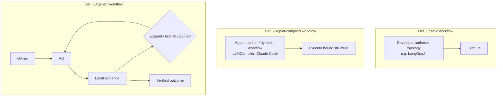
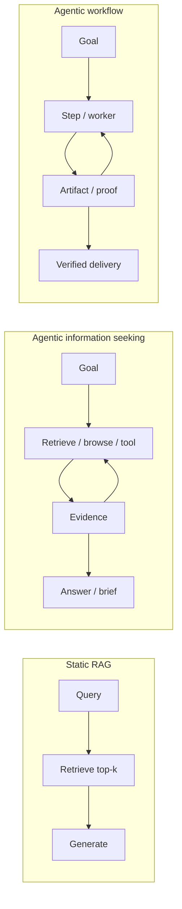
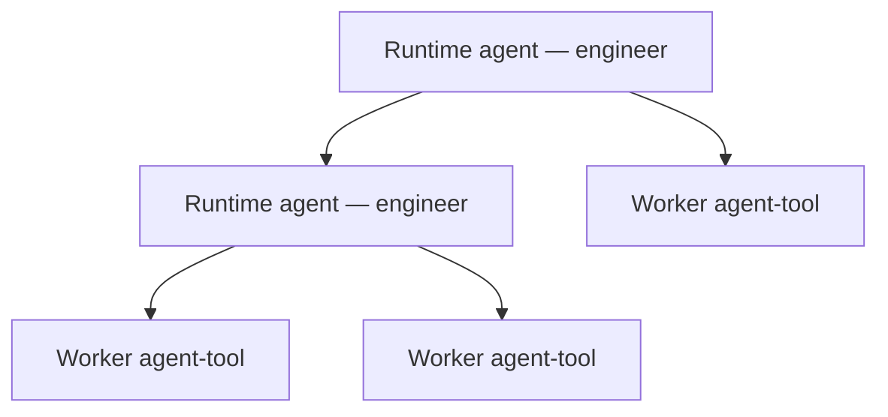
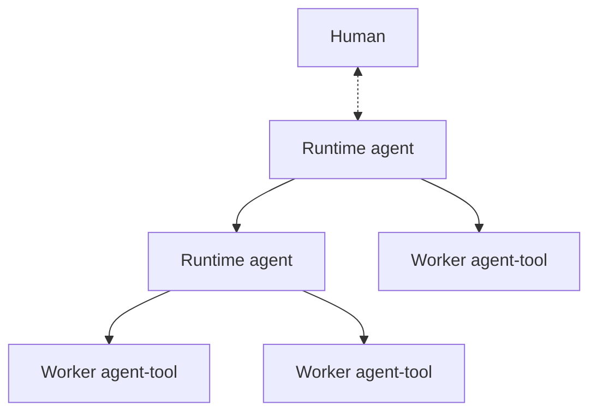

# Agentic Workflow: Runtime Agents over Worker Agents

| Field | Value |
|---|---|
| **Status** | Working paper draft (full citation + register pass) |
| **Date** | 2026-07-21 |
| **Type** | Position paper / research note |
| **Canonical path** | `agentic-workflow/README.md` |
| **Mirror** | [`materials/agentic_workflow.md`](../materials/agentic_workflow.md) |

**Abstract.** Multi-agent orchestration, state graphs, and agent-authored execution plans are increasingly proposed as the substrate of software autonomy [[3](#ref-3), [4](#ref-4), [7](#ref-7), [8](#ref-8), [38](#ref-38)]. Concurrent industry discourse layers *loop engineering* and *graph engineering* above prompting and harness design [[5](#ref-5), [6](#ref-6), [9](#ref-9)]. This note argues that many of these mechanisms optimize *compiled process topology*—including plans generated by the agent itself—while under-specifying *online ownership* of process growth. We introduce ***agentic workflow*** as both a **process policy** and a **role-typed multi-agent structure**: open-ended, owner-controlled progress that expands on demand under local evidence (Definition 3), realized as a **tree of runtime (engineer-layer) agents** with **worker agents as agent-tools at the leaves**. Runtime agents may communicate with each other and with workers; **workers never chat with each other** [[13](#ref-13), [23](#ref-23), [11](#ref-11), [12](#ref-12)]. The structure may grow from a single-engineer star into a deeper tree of runtime agents without ever becoming a worker peer mesh. The closest information-seeking analogue is agentic search/retrieval rather than static RAG [[1](#ref-1), [2](#ref-2), [10](#ref-10), [39](#ref-39), [43](#ref-43)]. Graphs remain legitimate representations [[3](#ref-3), [8](#ref-8)]; peer-dense multi-agent societies are not the default path to autonomy **(position)**.

**Citation policy.****Citation policy.** Numbered citations mark empirical, historical, architectural, or definitional claims. Text marked **(position)** denotes the authors’ thesis, definition, or design recommendation and is not presented as community consensus.

**TL;DR.** **Agentic workflow** is owner-led, on-demand process control under evidence (Definition 3), realized as a **tree of runtime (engineer-layer) agents** whose leaves are **worker agents positioned as agent-tools**. **Runtime agents are where agents should communicate**—like **teammates** who decide when to talk, monitor each other, and re-pair flexibly (far more flexible than predefined workflow edges) [[22](#ref-22), [9](#ref-9), [3](#ref-3)]; **worker agents never chat with each other**—they are agent-tools; peer worker chat is where complexity explodes [[13](#ref-13), [7](#ref-7), [23](#ref-23)]. Prefer this human-mimetic role split over agent-compiled DAGs and peer-dense multi-agent meshes for ordinary autonomy [[14](#ref-14), [22](#ref-22), [38](#ref-38), [19](#ref-19)]. Nearest analogue: agentic search/retrieval [[1](#ref-1), [39](#ref-39), [43](#ref-43)].

---

## 1. Introduction

Autonomous and semi-autonomous LLM agents are commonly decomposed into capabilities for planning, tool use, memory, and multi-agent coordination [[7](#ref-7), [16](#ref-16), [31](#ref-31)]. Tool-augmented single agents popularized interleaved reasoning and acting, as in ReAct [[17](#ref-17)]. Multi-agent frameworks extend this substrate to conversations and role specialization [[18](#ref-18), [7](#ref-7)]. Graph- and workflow-oriented systems such as LangGraph make control topology explicit as developer-authored nodes, edges, and shared state—i.e., static workflows in our terminology even when nodes call LLMs [[3](#ref-3), [35](#ref-35)]. Enterprise systems further externalize control into design-time agent graphs to mitigate goal drop-off and stochastic drift under pure prompt control [[4](#ref-4)].

A parallel line of work optimizes *function-call orchestration* by compiling multi-tool plans. LLMCompiler generates an execution plan akin to a directed acyclic graph (DAG), dispatches dependent tasks, and executes independent calls in parallel, reporting substantial latency and cost gains relative to sequential ReAct-style tool use [[38](#ref-38)]. Classical workflow engines likewise treat DAGs as first-class runnable artifacts [[21](#ref-21)]. Industry essays now name *graph engineering* as the discipline of wiring heterogeneous agentic and deterministic nodes into operable topologies above single-agent loops [[5](#ref-5), [6](#ref-6)].

These developments are technically real. They are not interchangeable with *online* process control. Least-commitment and continual planning literatures distinguish early binding of structure from deferred commitment under new observations [[14](#ref-14), [22](#ref-22)]. Agentic RAG surveys distinguish static retrieve-then-generate pipelines from iterative, tool-using controllers that replan retrieval actions from intermediate evidence [[1](#ref-1), [2](#ref-2), [10](#ref-10)].

**(Position)** This note claims that software-autonomy research and products over-index on *process compilation*—including agent-authored DAGs and dynamic multi-agent workflows—and under-index on *owner-led, on-demand process growth*. We call that target **agentic workflow**: both a control policy (Definition 3) and a **human-mimetic, role-typed multi-agent structure**—**runtime (engineer-layer) agents** that own process, and **worker agents as agent-tools** that never peer-chat. Today this is often a height-1 star (one runtime agent); later it may be a **tree of runtime agents**. It must not become a peer mesh of workers [[13](#ref-13), [23](#ref-23), [11](#ref-11), [12](#ref-12)].

### 1.1 Contributions

1. A crisp distinction among **static workflows** (exemplified by developer-authored LangGraph state graphs whose topology is fixed even when nodes are LLM-powered [[3](#ref-3)]), **agent-compiled workflows** (exemplified by LLMCompiler [[38](#ref-38)] and Claude Code dynamic workflows [[19](#ref-19), [20](#ref-20)]), and **agentic workflows** **(position)**, grounded in planning and RAG literatures [[14](#ref-14), [22](#ref-22), [1](#ref-1), [21](#ref-21)].  
2. A merged account of **agentic search** and **agentic retrieval**, and an explicit lift from that family to **agentic workflow** as control over process structure rather than only over documents [[1](#ref-1), [2](#ref-2), [39](#ref-39), [40](#ref-40), [41](#ref-41), [42](#ref-42), [43](#ref-43), [44](#ref-44)].  
3. A **flat-over-deep** design bias for engineering autonomy, linked to coordination costs and supervisor patterns [[11](#ref-11), [12](#ref-12), [13](#ref-13)].  
4. A related-work map spanning planning, MAS, graph orchestration, HCI of AI coding tools, and enterprise hybrid control [[7](#ref-7), [8](#ref-8), [3](#ref-3), [4](#ref-4), [23](#ref-23)].  
5. Normative principles and an evaluation agenda **(position)**.

---

## 2. Background and related work

### 2.1 Single-agent tool loops

ReAct couples verbal reasoning with environment actions in an interleaved loop and is a canonical baseline for sequential tool use [[17](#ref-17)]. Surveys of LLM-based autonomous agents position tool use and planning as core modules alongside memory [[16](#ref-16)]. Long-context models remain sensitive to the position of relevant information, which motivates isolation and careful context management in multi-step systems [[29](#ref-29)].

### 2.2 Compiled and parallel tool plans

LLMCompiler addresses latency, cost, and occasional inaccuracy in sequential function calling by introducing a planner that emits a DAG-like function-call plan, a task-fetching unit that respects dependencies, and an executor that runs ready calls concurrently [[38](#ref-38)]. Reported gains include up to approximately \(3.7\times\) latency improvement, \(6.7\times\) cost reduction, and about \(9\%\) accuracy improvement against ReAct-style baselines on evaluated tasks [[38](#ref-38)]. Architecturally, LLMCompiler is an instance of **agent-side compilation of an execution graph** followed by dependency-aware execution [[38](#ref-38)].

This pattern is aligned with classical DAG workflow engines, which bind control structure before or at submission time and then execute [[21](#ref-21)]. It is *related to but distinct from* developer-authored graph frameworks such as LangGraph, which also bind topology as a durable artifact before a run, even when individual nodes invoke LLMs [[3](#ref-3), [35](#ref-35)]; LLMCompiler binds an *agent-generated* plan, whereas LangGraph typically binds a *developer-authored* graph [[38](#ref-38), [3](#ref-3)].

### 2.3 Multi-agent systems and topology

Wooldridge and Jennings define intelligent agents as systems that perceive and act toward goals under autonomy-related properties [[31](#ref-31)]. LLM multi-agent surveys catalog role specialization, communication, and evaluation challenges as agent count and interaction complexity grow [[7](#ref-7)]. Architecture guides enumerate supervisor, hierarchical, peer-to-peer, blackboard, and swarm patterns and discuss task fit [[13](#ref-13)]. Classical coordination mechanisms include the Contract Net Protocol for task allocation [[32](#ref-32)] and blackboard control architectures for shared-state specialist contribution [[33](#ref-33), [34](#ref-34)]. AutoGen exemplifies conversation-centric multi-agent application construction [[18](#ref-18)].

Bei et al. survey how graphs support agent planning, execution, memory, and multi-agent coordination, and how agents conversely assist graph learning [[8](#ref-8)]. GraphRAG and knowledge-graph engineering structure *what is known* for retrieval and synthesis [[36](#ref-36), [10](#ref-10)], which is distinct from structuring *who may act and in what order* [[5](#ref-5)].

### 2.4 Enterprise hybrid control and industry layering

Salesforce’s Agentforce Agent Graph describes hybrid reasoning in which design-time graphs externalize SOP-like control, handoff, and delegation to reduce goal drop-off that arises when control remains only in conversational memory and prompts [[4](#ref-4)]. Industry loop-engineering writing emphasizes outer-loop ownership, verification bottlenecks, and the insufficiency of generation-speed alone [[9](#ref-9)]. Graph-engineering guides position topology design above single-agent loops and acknowledge additional failure modes: state schemas, routing bugs, merge errors, and operational load [[5](#ref-5), [6](#ref-6)].

### 2.5 Planning under deferred commitment

Least-commitment planning postpones binding decisions until necessary [[14](#ref-14)]. HTN planning expands high-level tasks into refinements without requiring all primitive steps to be fixed immediately [[27](#ref-27), [15](#ref-15)]. Continual planning surveys address replanning as the world changes during execution [[22](#ref-22)]. These traditions supply the formal intuition for *provisional* process structure.

### 2.6 Agentic retrieval and agentic search

Lewis et al. formulate retrieval-augmented generation as coupling parametric models with non-parametric memory via retrieval [[10](#ref-10)]. Subsequent work makes retrieval itself a sequential decision problem: FLARE performs active retrieval during generation [[39](#ref-39)]; IRCoT interleaves retrieval with chain-of-thought [[42](#ref-42)]; Self-RAG learns on-demand retrieve/generate/critique behavior [[40](#ref-40)]; CRAG evaluates and corrects retrieval results [[41](#ref-41)]. Surveys group these under Agentic RAG, contrasting them with static pipelines [[1](#ref-1), [2](#ref-2)]. In parallel, product and research systems for multi-step web investigation—agentic search / deep research—plan, browse, and revise under an owner agent, sometimes with parallel subagents [[43](#ref-43), [44](#ref-44), [45](#ref-45)]. Section 5 merges these strands.

### 2.7 Human supervision of AI coding tools

Empirical HCI and SE studies find that developers using code-generation assistants continue to direct, inspect, correct, and integrate outputs rather than fully delegating process ownership [[23](#ref-23), [24](#ref-24), [25](#ref-25)]. Industry measurements of AI-assisted code prevalence coexist with incomplete trust and verification practices [[37](#ref-37), [9](#ref-9)]. Coding-agent product documentation exposes multi-agent and workflow features largely as capabilities of a primary agent session [[19](#ref-19), [20](#ref-20)].

### 2.8 Organizational coordination cost

Organization theory treats hierarchy and lateral coordination as information-processing structures with real overhead [[11](#ref-11), [26](#ref-26)]. Brooks argues that adding manpower to late software projects increases communication paths and can reduce effective progress [[12](#ref-12)]. These results caution against naive “more agents ⇒ more autonomy” scaling **(position, with anchors)**.

### 2.9 Social simulation as a different objective

Generative-agent simulations study believable multi-agent social behavior as a research end in itself [[28](#ref-28)]. That objective differs from delivering a scoped engineering artifact under an accountable owner **(position)**.

---

## 3. Problem statement

Let a *software autonomy episode* be a bounded attempt to move from a goal specification \(G\) and environment \(E\) (repository, tools, tests, browsers) to a verified outcome \(O\) under budget \(B\).

Existing stacks often optimize one of:

1. **Node competence** — stronger single-agent loops and tools [[17](#ref-17), [16](#ref-16)];  
2. **Bound topology** — static developer graphs (e.g., LangGraph) or agent-compiled plans (e.g., LLMCompiler; Claude Code dynamic workflows), then executed [[3](#ref-3), [21](#ref-21), [38](#ref-38), [19](#ref-19), [20](#ref-20)];  
3. **Rich multi-agent interaction** — many roles and message paths [[7](#ref-7), [18](#ref-18)].  

**(Position)** Insufficiently optimized is **online ownership of process growth**: which step exists, which worker is alive, what context is shared, when to stop, and how a human retakes control—conditional on evidence obtained so far [[22](#ref-22), [14](#ref-14), [4](#ref-4), [23](#ref-23)].

Failure modes of topology-first autonomy include operational opacity and coordination overhead documented in graph-engineering practice notes [[5](#ref-5), [6](#ref-6)], goal drift under weakly externalized control [[4](#ref-4)], and human babysitting cost in AI-assisted engineering [[23](#ref-23), [25](#ref-25), [9](#ref-9)].

---


## 4. Definitions and terminology

### 4.1 Preliminaries

We write \(G\) for a goal with an acceptance bar, \(E\) for the environment (repository, tools, tests, browsers, corpora), and an *episode* for a bounded attempt to achieve a verified outcome in \(E\) under budget \(B\) (§3). Following multi-agent architecture usage, an *owner* is the accountable controller of \(G\) and of process growth, and a *worker* is a delegated trajectory with a narrower mandate [[13](#ref-13), [9](#ref-9), [17](#ref-17)]. A *height-1 tree* is a supervision topology in which the owner delegates directly to workers without an intermediate manager chain [[13](#ref-13)].

We distinguish **representation** (sequence, tree, DAG, state graph) from **binding time** (when admissible structure becomes fixed for execution). Graphs are legitimate representations of agent systems [[3](#ref-3), [8](#ref-8)]. Binding time determines whether a system is static, agent-compiled, or agentic in the sense defined below.

### 4.2 Key terminology

| Term | Definition (short) | Binding of process structure | Canonical example(s) | Primary anchors |
|---|---|---|---|---|
| **Static workflow** | Executable control graph whose nodes/edges are fixed before the episode runs; nodes may still be LLM-powered | Developer/human, pre-run | **LangGraph** `StateGraph` apps [[3](#ref-3), [35](#ref-35)]; Airflow DAGs [[21](#ref-21)] | [[3](#ref-3), [21](#ref-21)] |
| **Agent-compiled workflow** | Control graph/plan generated by an agent planner early, then largely executed as bound | Agent planner, early-run | **LLMCompiler** [[38](#ref-38)]; **Claude Code dynamic workflows** / agent teams [[19](#ref-19), [20](#ref-20)] | [[38](#ref-38), [19](#ref-19), [20](#ref-20)] |
| **Agentic workflow** | Owner-led progress that expands/prunes structure on demand under evidence | Owner, continual / provisional | Engineer-layer owner loop **(position)**; analogue: agentic search/retrieval [[1](#ref-1), [39](#ref-39), [43](#ref-43)] | this paper; [[22](#ref-22), [14](#ref-14), [1](#ref-1)] |
| **Runtime agent** | Engineer-layer owner/orchestrator of agentic workflow | Internal tree nodes | Human engineer; AdaL Engineer-class agent | [[9](#ref-9), [13](#ref-13)]; §4.6 |
| **Worker agent (agent-tool)** | Producer agent used as runtime-agent instrument; never peers with workers | Leaf nodes only | Coding/review/browse under a runtime agent | n/a | Coding / review / browse worker under engineer | [[13](#ref-13), [17](#ref-17), [19](#ref-19)]; §4.6 |
| **Runtime tree** | Tree of runtime agents; worker agents only as leaves; empty worker cut | **Structural form of agentic workflow** | Height-1 star today; deeper runtime tree later | [[13](#ref-13), [23](#ref-23)]; §4.6 |
| **Worker↔worker edge** | Direct producer peer messaging | **Never** **(position)** — workers are tools, not peers | — | §4.6, §6.2 |
| **Engineer↔engineer edge** | Owner–owner collaboration | Future multi-engineer scale-out **(position)** | Coupled stars | §4.6 |
| **Engineer↔producer edge** | Task/report hub links | Required | Star edges | §4.6 |
| **Agentic retrieval** | Corpus-grounded iterative retrieve/control | Evidence actions unbound a priori | FLARE, IRCoT, Self-RAG, CRAG, Agentic RAG [[39](#ref-39), [42](#ref-42), [40](#ref-40), [41](#ref-41), [1](#ref-1)] | §5 |
| **Agentic search** | Multi-step open/web investigative control under a research owner | Evidence actions unbound a priori | Deep research; multi-agent research systems [[43](#ref-43), [44](#ref-44), [45](#ref-45)] | §5 |
| **Agentic information seeking** | Umbrella for agentic retrieval + agentic search | Online evidence control | §5 | §5 |
| **Static RAG** | Retrieve-then-generate with little online retrieval policy | Retrieval plan effectively fixed | Classical RAG [[10](#ref-10)] | [[10](#ref-10)] |
| **Loop engineering** | Design of one agent’s observe–act–verify cycle | Node-local | ReAct-style loops; industry loop discourse [[17](#ref-17), [9](#ref-9)] | [[9](#ref-9), [17](#ref-17)] |
| **Graph engineering** | Design of multi-node topology above loops | Topology-first (often pre-run or early-run) | Industry graph-engineering discourse [[5](#ref-5), [6](#ref-6)] | [[5](#ref-5), [6](#ref-6)] |
| **Crystallization** | Promoting a repeated successful online process into a static workflow | Post hoc stabilization | Process mining → DAG [[30](#ref-30), [21](#ref-21)] | [[30](#ref-30)] |

### 4.3 Static workflow

We use *static workflow* for control structures whose **topology is authored before the episode** and then interpreted by a runtime, regardless of whether node bodies are deterministic functions or LLM agents.

> **Definition 1 (Static workflow).** A *static workflow* is a tuple of nodes, admissible transitions, and shared state schema whose control topology is fixed prior to episode execution and then run by an orchestrator [[3](#ref-3), [21](#ref-21)].

**Primary exemplar: LangGraph.** LangGraph models agent applications as explicit graphs: developers define state, add nodes, and add edges, then execute the graph [[3](#ref-3), [35](#ref-35)]. Critically, **LLM-powered nodes do not make the workflow agentic in our sense**. The topology—who runs after whom, which branches exist—is typically developer-bound before the run, even if each node performs sophisticated model inference [[3](#ref-3)]. Classical workflow engines such as Airflow instantiate the same binding pattern with predominantly non-LLM operators [[21](#ref-21)].

Enterprise design-time agent graphs that encode SOP-like transitions similarly externalize a largely fixed control skeleton before conversational execution [[4](#ref-4)]. We classify these as static (or hybrid-static) at the topology layer, while acknowledging stochasticity inside nodes [[4](#ref-4), [3](#ref-3)].

### 4.4 Agent-compiled workflow

> **Definition 2 (Agent-compiled workflow).** An *agent-compiled workflow* is a control plan or graph whose topology is generated by an agent (or planner module) early in an episode and thereafter largely executed as a bound artifact [[38](#ref-38), [19](#ref-19), [20](#ref-20)].

This class includes both research planners that emit tool DAGs and product coding-agent features that materialize multi-step or multi-agent process structure and then run it.

**Exemplar A: LLMCompiler (research).** LLMCompiler’s planner emits a DAG-like function-call plan; a task-fetching unit dispatches ready tasks; an executor runs independent calls in parallel, with large reported latency and cost gains versus sequential ReAct-style calling [[38](#ref-38)]. The plan is *dynamic relative to the user query* but *static relative to the remainder of execution* once compiled [[38](#ref-38)].

**Exemplar B: Claude Code dynamic workflows (product).** Anthropic’s Claude Code exposes dynamic workflow and related multi-agent capabilities in which the coding agent constructs process structure (workflows, agent/tool fan-out, coordinated subtasks) as part of handling a request, then executes that structure [[19](#ref-19), [20](#ref-20)]. In our taxonomy this is agent-compiled: the topology is **agent-authored for the episode**, not developer-authored like a LangGraph app [[3](#ref-3)], and it is **bound early enough to function as a machine the session then runs**, rather than remaining a fully provisional owner policy under Definition 3 [[20](#ref-20), [22](#ref-22)]. Agent teams and workflow tools in the same product family similarly extend a primary coding-agent session with structured multi-node execution [[19](#ref-19), [20](#ref-20)].

**Fact.** Generation-time dynamism—“the agent just built this workflow”—does not imply continual revisability in the agentic-workflow sense [[38](#ref-38), [20](#ref-20), [22](#ref-22)].

**Contrast with LangGraph.** LangGraph is usually a **static workflow framework** (developer-authored topology), even when every node is an LLM [[3](#ref-3)]. LLMCompiler and Claude Code dynamic workflows are **agent-compiled**: an agent binds the plan/topology for the episode [[38](#ref-38), [20](#ref-20)]. All three may look like graphs; they differ in *who binds the edges* and *when*.

### 4.5 Agentic workflow (official definition)

We now introduce the central notion of this paper.

> **Definition 3 (Agentic workflow).**  
> We define an ***agentic workflow*** as *open-ended, owner-controlled task progress in which process structure is expanded on demand—sequentially or with branching—under local evidence, rather than compiled into a fixed multi-node machine up front*.

Equivalently: structure (steps, workers, handoffs) remains **provisional**; the owner may add, start, pause, or remove structure as observations arrive; parallelism is permitted but not required; stopping depends on verification of \(G\), not on exhausting a precommitted graph.

**Remark (alignment).** Definition 3 is deliberately aligned with continual and least-commitment planning [[22](#ref-22), [14](#ref-14)], HTN-style refinement-when-needed [[27](#ref-27)], supervisor–worker control [[13](#ref-13)], and agentic information seeking (§5) [[1](#ref-1), [39](#ref-39), [43](#ref-43)]. It is a **positional definition** for this research program, not a claim of prior standardized terminology.

**Remark (non-examples).** A LangGraph application with fixed edges is a static workflow even if every node is an LLM [[3](#ref-3)]. An LLMCompiler plan or a Claude Code dynamic workflow is agent-compiled even if the planner is highly capable [[38](#ref-38), [20](#ref-20)]. A multi-agent mesh with no accountable owner is multi-agent but not agentic workflow in our sense [[13](#ref-13), [7](#ref-7)].

**Remark (representation and roles).** Definition 3 constrains **binding time and ownership**. **(Position)** The preferred *structural realization* is a **tree of runtime agents** with **worker agents as agent-tools** and an **empty worker–worker cut** (§4.6). Height may be 1 or greater among runtime agents. A mesh of workers chatting is not agentic workflow structure.



### 4.6 Structure of agentic workflow: runtime agents and worker agents

***Agentic workflow*** names both Definition 3’s process policy and the **role-typed multi-agent structure** used to realize it.

We distinguish two roles—not two levels of “smartness”:

| Role | Also called | Mandate | May message |
|---|---|---|---|
| **Runtime agent** | Engineer-layer agent, owner, orchestrator | Owns \(G\), expands/prunes process, allocates work, verifies, collaborates with humans/other runtime agents | Other **runtime** agents; **worker** agents; humans |
| **Worker agent** | Producer, agent-tool | Narrow execution (code, review, browse, retrieve); no outer-loop ownership | **Only** its supervising runtime agent (and owner-visible artifacts) |

A worker may *internally* be a full tool-using agent with its own loop [[17](#ref-17), [19](#ref-19)]. **In the workflow graph it is an instrument of a runtime agent**, not a peer collaborator **(position)**.

#### Topology: tree of runtime agents, tools at the leaves **(position)**

The **control/communication graph** is a **tree** (or forest) whose internal nodes are runtime agents and whose leaves are worker agents:

```text
                    runtime agent (engineer)
                   /         |            \
          runtime agent    worker        worker
             /      \
        worker     worker
```

- **Today (common case):** height 1 — one runtime agent and \(n\) workers = **star** / rooted tree of height 1 (single-engineer practice) [[13](#ref-13), [23](#ref-23)].  
- **Future:** height \(\ge 1\) — runtime agents may supervise other runtime agents *or* workers, forming a deeper **tree of engineer-layer roles**.  
- **Invariant:** the induced subgraph on **worker agents is empty**. **Workers never chat with each other.** Peer worker chat is where complexity explodes (hidden state, races, un-owned coordination) [[7](#ref-7), [5](#ref-5)].

Formally, partition vertices into runtime set \(R\) and worker set \(W\). Allowed undirected edges satisfy:
\[
E \subseteq \big\{\{r,r'\}: r,r'\in R\big\}
  \cup \big\{\{r,w\}: r\in R,\ w\in W\big\},
\]
with \(E \cap \big\{\{w,w'\}: w,w'\in W\big\} = \emptyset\). Edges among \(R\) are **encouraged** when multiple engineer-layer seats collaborate; edges among \(W\) are **forbidden**. The graph on \(R \cup W\) remains a **tree** (unique path between nodes; single accountable root per episode, or a forest of episodes).

```text
Allowed:     runtime ↔ runtime
             runtime ↔ worker   (worker = agent-tool)

Forbidden:   worker  ↔ worker
```

**Why “runtime” not only “manager.”** The internal nodes are not generic middle management. They are **engineer-layer runtime agents**: seats that run agentic workflow—memory, expansion policy, verification, human takeover [[9](#ref-9), [13](#ref-13)]. Workers are **agent-tools** attached to those seats.

**Where agents should communicate.** Multi-agent *collaboration* belongs on the **runtime tier**: runtime agents talk to runtime agents and each runtime agent talks to its worker agent-tools. **That is the intended locus of agent-to-agent communication.** Worker–worker chat is not “more multi-agent”—it is the wrong tier, and it is where complexity becomes unmanageable [[7](#ref-7), [5](#ref-5)] **(position)**.

#### Runtime talk as teammate collaboration **(position)**

Runtime↔runtime communication is **not** a predefined workflow edge set. It is closer to **teammates on an engineering staff**:

| Teammate property | Runtime-agent analogue |
|---|---|
| Decide *when* to talk | Online initiation: ask, ping, escalate, or stay silent based on local evidence [[22](#ref-22), [14](#ref-14)] |
| Decide *what* to say | Goal, constraints, artifacts, risk—not a fixed message schema alone |
| Monitor each other | Observe progress, blockers, quality signals; intervene or redirect [[4](#ref-4), [9](#ref-9)] |
| Flexible pairing | Ad hoc co-planning, handoff, review, or parallel ownership under a shared bar |
| Still accountable seats | Each runtime agent remains an owner of some scope—not a nameless node in a DAG [[9](#ref-9), [13](#ref-13)] |

This is **strictly more flexible than static or agent-compiled workflows** [[3](#ref-3), [21](#ref-21), [38](#ref-38), [20](#ref-20)]: those bind *who talks after whom* before (or early in) execution. Teammate-style runtime talk keeps **initiation, monitoring, and re-pairing provisional**—the same agentic binding-time discipline as Definition 3, lifted from process steps to **collaboration among engineer-layer seats**.

```text
Predefined workflow:     edge list fixed → messages follow the graph
Agentic runtime talk:    teammates decide when/whether to talk, monitor, re-pair
                         under goals and evidence (not a frozen org chart)
```

Worker agent-tools remain non-teammates: they are invoked and reported through a runtime agent; they do not hold teammate politics **(position)**.

**Parallelism.** Large partitioned fan-out is still owner-mediated: a runtime agent spawns many worker agent-tools and joins results at the hub [[38](#ref-38), [13](#ref-13)]. Parallel multi-agent labor does not require worker peer chat **(position)**.

**Human mimicry.** This matches how humans work at the lowest levels: an engineer uses helpers as tools; engineers talk to engineers; helpers do not form a private committee [[23](#ref-23), [24](#ref-24)].

**(Position)** For most autonomy goals, keep agentic workflow simple: tree of runtime agents, worker agents only as tools, no worker peer-chat. Dense worker multi-agent is a special case for super-large partitioned work—not the default.

### 4.7 Representation versus policy

LangGraph and Airflow show that **graphs can encode static workflows** [[3](#ref-3), [21](#ref-21)].  
LLMCompiler shows that **graphs can encode agent-compiled plans** [[38](#ref-38)].  
Agentic search shows that **highly capable iterative control need not precommit a full action graph** [[39](#ref-39), [1](#ref-1), [43](#ref-43)].  

**(Position)** Agentic workflow is a *control policy* over when structure becomes binding. A sequential owner loop can satisfy Definition 3; a rich graph can fail it.


## 5. Agentic search and agentic retrieval

This section unifies two overlapping literatures that supply the closest mechanistic analogue to agentic workflow: **agentic retrieval / agentic RAG** (corpus-grounded iterative retrieval control) and **agentic search / deep research** (open-web or multi-source investigative control). We treat them as one family—*agentic information seeking*—and then lift that family from navigating *evidence* to navigating *process structure*.

### 5.1 From static RAG to active and agentic retrieval

**Static RAG.** Lewis et al. formulate retrieval-augmented generation as combining parametric LMs with non-parametric memory via retrieval before (or around) generation [[10](#ref-10)]. In the simplest operational form, systems retrieve a top-\(k\) set once and then generate [[10](#ref-10), [1](#ref-1)].

**Active retrieval during generation.** FLARE (Forward-Looking Active REtrieval) iteratively decides *when* and *what* to retrieve by using predictions of upcoming content, rather than retrieving only once up front [[39](#ref-39)]. This is an early, influential move from passive retrieve-then-read toward retrieval as an ongoing control decision [[39](#ref-39)].

**Interleaved retrieval and reasoning.** IRCoT interleaves retrieval with chain-of-thought steps for knowledge-intensive multi-step questions, so each reasoning hop can trigger new evidence gathering rather than consuming a single frozen context pack [[42](#ref-42)].

**Self-reflective retrieval control.** Self-RAG trains models to retrieve, generate, and critique on demand through self-reflection tokens, enabling adaptive retrieval rather than fixed always-retrieve or never-retrieve policies [[40](#ref-40)].

**Corrective retrieval.** CRAG introduces evaluators over retrieved documents and corrective actions (including web fallback / refine-as-needed behaviors in the broader corrective-RAG line), so low-quality retrieval does not silently poison generation [[41](#ref-41)].

**Agentic RAG as a named paradigm.** Recent surveys synthesize these strands under *Agentic RAG*: systems that employ autonomous agents for dynamic decision-making, iterative reasoning, query refinement, tool use, and adaptive retrieval strategies, explicitly contrasting them with static RAG pipelines [[1](#ref-1), [2](#ref-2)]. Taxonomies in this literature include single-agent, multi-agent, hierarchical, corrective, adaptive, and graph-based agentic RAG variants [[1](#ref-1), [2](#ref-2)].

**Relation to tool-using agents.** ReAct provides the generic interleaved reason–act scaffold often reused inside retrieval agents (search tool → observe snippet → next action) [[17](#ref-17)]. Long-context position sensitivity further motivates iterative, targeted retrieval over stuffing large unfiltered corpora into one window [[29](#ref-29)].

### 5.2 Agentic search and deep research systems

Where agentic RAG is typically framed around grounded generation from corpora, **agentic search** emphasizes multi-step investigation over web or heterogeneous sources.

OpenAI describes *deep research* as an agentic capability that conducts multi-step internet research for complex tasks, rather than returning a single search page of links [[43](#ref-43)]. Anthropic’s multi-agent research system describes an agent that plans a research process and launches parallel tool-using subagents, then synthesizes results—an explicit process controller over search work [[44](#ref-44)]. Survey and position papers on the shift “from web search towards agentic deep research” trace the evolution from static query–result pages to interactive agents that plan, explore, and revise [[45](#ref-45)].

These systems differ in product packaging, but share a control pattern with agentic RAG: **evidence-conditioned next actions under an owner trajectory**, not a fully precommitted query DAG [[1](#ref-1), [43](#ref-43), [44](#ref-44), [45](#ref-45)].

### 5.3 Unified family: agentic information seeking

| Pattern | Core control idea | Representative anchors |
|---|---|---|
| Static RAG | Retrieve once (or few fixed stages), then generate | [[10](#ref-10)] |
| Active / interleaved retrieval | Decide when/what to retrieve during reasoning or generation | FLARE [[39](#ref-39)]; IRCoT [[42](#ref-42)] |
| Self-reflective / corrective retrieval | Evaluate retrieval quality; retrieve again, revise, or abstain | Self-RAG [[40](#ref-40)]; CRAG [[41](#ref-41)] |
| Agentic RAG (survey construct) | Agent policies over iterative retrieval + tools + stopping | [[1](#ref-1), [2](#ref-2)] |
| Agentic search / deep research | Multi-step web/multi-source investigation under a research owner | [[43](#ref-43), [44](#ref-44), [45](#ref-45)] |
| Sequential tool agents | Generic observe–act loops usable for search tools | ReAct [[17](#ref-17)] |
| Compiled parallel tool plans | Early DAG of calls, then execute (different binding-time regime) | LLMCompiler [[38](#ref-38)] |

**Terminology in this note.** We use **agentic retrieval** for corpus-grounded iterative control [[1](#ref-1), [39](#ref-39), [40](#ref-40), [41](#ref-41), [42](#ref-42)] and **agentic search** for open investigative control over web or mixed sources [[43](#ref-43), [44](#ref-44), [45](#ref-45)]. When the distinction is immaterial, we say **agentic information seeking**.

### 5.4 What the family shares (mechanistic invariants)

Across agentic retrieval and agentic search, published systems recurrently exhibit:

1. **Deferred commitment about the next evidence action** — next query/tool is not fully fixed at \(t=0\) [[39](#ref-39), [42](#ref-42), [1](#ref-1)].  
2. **Observation-conditioned replanning** — intermediate documents change subsequent actions [[40](#ref-40), [41](#ref-41), [44](#ref-44)].  
3. **Explicit or implicit stop rules** — sufficiency, budget, or self-critique ends the loop [[40](#ref-40), [1](#ref-1), [43](#ref-43)].  
4. **Optional parallelism under an owner** — subagents or parallel fetches may run, but synthesis remains centralized in described research systems [[44](#ref-44), [38](#ref-38)].  
5. **Tool mediation** — search APIs, browsers, retrievers, and calculators are invoked as actions [[17](#ref-17), [43](#ref-43), [44](#ref-44)].  

These invariants match continual/least-commitment control more than classical static pipelines [[22](#ref-22), [14](#ref-14), [10](#ref-10)].

### 5.5 Mapping information seeking → agentic workflow

| Agentic information seeking | Agentic workflow **(position mapping)** |
|---|---|
| Information or research need [[43](#ref-43), [10](#ref-10)] | Outcome need with acceptance bar |
| Next query / retrieval / browse action [[39](#ref-39), [42](#ref-42)] | Next process step or worker spawn |
| Retrieved passage or page [[10](#ref-10), [41](#ref-41)] | Intermediate artifact, test, or review signal |
| Query reformulation / corrective retrieval [[40](#ref-40), [41](#ref-41)] | Replan step, replace worker, change decomposition |
| Stop on sufficient evidence [[1](#ref-1), [40](#ref-40)] | Stop on verified outcome |
| Research owner thread [[44](#ref-44), [43](#ref-43)] | Engineer-owner thread [[9](#ref-9), [13](#ref-13)] |
| Parallel sub-research under planner [[44](#ref-44), [38](#ref-38)] | Optional short-lived height-1 fan-out, then merge |

**(Position — claim)** Agentic workflow is agentic information seeking lifted from navigation over *evidence* to navigation over *process structure*.

### 5.6 Important non-collapse

Agentic information seeking does **not** license arbitrary deep multi-agent bureaucracy. Anthropic’s research system uses parallel subagents under a planning owner [[44](#ref-44)]; that is still closer to height-1 (or shallow) orchestration than to an autonomous company graph [[13](#ref-13)]. LLMCompiler parallelizes *known* tool dependencies via a compiled plan [[38](#ref-38)]; that is often the right optimization *inside* a step, not a substitute for online ownership of the whole engineering episode **(position)**.

**(Position)** Nobody treats “compile a 40-node retrieval DAG and execute it regardless of findings” as the gold standard of research [[1](#ref-1), [39](#ref-39)]. Analogous compile-then-run process graphs should not be the gold standard of open-ended software work either [[5](#ref-5), [19](#ref-19), [38](#ref-38)].




## 6. Flat over deep

### 6.1 Coordination cost

As collaborative structure widens and deepens, communication and coordination costs rise in human organizations [[11](#ref-11), [26](#ref-26)] and in software projects specifically [[12](#ref-12)]. LLM multi-agent systems inherit analogous coordination and evaluation difficulties [[7](#ref-7)]. Graph-engineering practice notes similarly report topology-dependent operational burden [[5](#ref-5), [6](#ref-6)].

**(Position)** Therefore flat control is the correct *default* for scoped engineering autonomy.

### 6.2 Trees of runtime agents, not meshes of workers

Supervisor–worker topologies are first-class patterns in multi-agent architecture guidance [[13](#ref-13)]. Human use of coding assistants remains supervisory [[23](#ref-23), [24](#ref-24), [25](#ref-25)]. Product multi-agent features in coding agents are commonly tool-mediated under a primary session [[19](#ref-19), [20](#ref-20)].



**(Position)** Agentic workflow’s structural form is a **tree of runtime agents** with **worker agents as agent-tools**. Height may be 1 (single engineer star) or greater (runtime agents supervising other runtime agents). What must not appear is a **worker peer mesh**.

**(Position — hard rule)** **Worker agents never chat with each other.** They are tools of a runtime agent. Peer worker chat makes complexity unmanageable [[7](#ref-7), [5](#ref-5)]. **Runtime agents should communicate**—with other runtime agents and with their workers. That tier is where multi-agent collaboration belongs; that is how the tree grows without becoming a society of producers **(position)**.

**(Position)** For ordinary automation toward autonomy, **keep it simple and model it this way**. Reserve dense multi-agent parallel among producers for genuinely large partitioned workloads—not as the default autonomy architecture [[11](#ref-11), [12](#ref-12), [7](#ref-7)].

### 6.3 When depth or compilation is justified

Compiled or deeper structure is well motivated when:

1. **Known parallel tool dependencies** dominate latency—LLMCompiler’s setting [[38](#ref-38)];  
2. **Stable, repeated processes** should be workflow engines [[21](#ref-21), [30](#ref-30)];  
3. **Enterprise SOP compliance and anti-drop-off** require externalized graphs [[4](#ref-4)];  
4. **Hard isolation** is the product (untrusted eval, security boundaries) [[8](#ref-8), [4](#ref-4)];  
5. **Institutional or social simulation** is the scientific goal [[28](#ref-28)].

**(Position)** Depth should be earned. Crystallization of a repeated agentic pattern into a static DAG should follow demonstrated stability [[30](#ref-30), [21](#ref-21)], not precede understanding.

### 6.4 Organizational metaphor

**(Position)** Autonomy for a scoped engineering outcome should prefer an engineer-owner over a manager chain over a simulated executive hierarchy. Army-scale agent deployment can complete work and still be the wrong abstraction unit when coordination destroys steerability [[12](#ref-12), [11](#ref-11), [5](#ref-5)]. Scale by adding **engineers** (coupled stars) and engineer↔producer links—not worker peer networks **(position)**.

---

## 7. Comparative analysis

| Dimension | Static workflow [[3](#ref-3), [21](#ref-21)] | Agent-compiled DAG / dynamic workflow [[38](#ref-38), [19](#ref-19)] | Tool-multi-agent inside one coding agent [[19](#ref-19), [20](#ref-20), [17](#ref-17)] | Agentic workflow **(position)** |
|---|---|---|---|---|
| Structure author | Human | Agent planner early | Implicit in primary agent tools | Owner, continuously |
| Binding time | Pre-run | Early-run compile | Mostly implicit | Deferred / revisable [[14](#ref-14), [22](#ref-22)] |
| Parallelism | Designed | First-class (LLMCompiler; Claude Code workflows) [[38](#ref-38), [20](#ref-20)] | Tool fan-out | On-demand |
| Strength | Auditability, stability | Latency/cost on known decompositions [[38](#ref-38)] | Local coding competence | Open-ended goal pursuit |
| Primary risk | Brittleness under novelty | Ops opacity; wrong early topology [[5](#ref-5)] | Context rot; weak isolation [[29](#ref-29)] | Weak owner; missing stop rules |
| Human role | Designer/operator | Auditor of compiled plan | Supervisor of one session [[23](#ref-23)] | Owner with selective delegation |

### 7.1 Runtime teammate talk vs predefined workflow edges

| | Predefined / agent-compiled workflow edges [[3](#ref-3), [38](#ref-38), [21](#ref-21)] | Runtime↔runtime talk in agentic workflow **(position)** |
|---|---|---|
| Who initiates | Topology / planner | Runtime agents, on evidence |
| When | Bound early | Anytime (ask, monitor, escalate, go quiet) |
| Monitoring | Often external to the graph | First-class among teammates [[4](#ref-4), [9](#ref-9)] |
| Re-pairing | Rewire graph / recompile | Natural teammate re-coordination |
| Flexibility | Low–medium once bound | High, still owner-accountable |
| Worker role | Maybe graph nodes | Agent-tools only; no peer chat |

### 7.1 Non-equivalences

Multi-agent organization does not imply agentic workflow; fixed meshes are multi-agent [[13](#ref-13), [7](#ref-7)].  
Dynamic generation does not imply online revisability; LLMCompiler plans and Claude Code dynamic workflows are compiled (or early-bound) artifacts relative to the rest of the run [[38](#ref-38), [20](#ref-20)].  
Graph representation does not imply agency; Airflow DAGs are graphs [[21](#ref-21)].  
More roles do not imply more autonomy; autonomy concerns goal-directed action under constraints [[31](#ref-31)] and outer-loop accountability [[9](#ref-9)].

---

## 8. What agentic workflow is for

### 8.1 Target problems

1. **Supervision tax** in AI-assisted engineering [[23](#ref-23), [24](#ref-24), [25](#ref-25)].  
2. **Compile-then-suffer complexity** when topologies outpace operability [[5](#ref-5), [6](#ref-6)].  
3. **Steerability failures** under weakly externalized or over-opaque control [[4](#ref-4), [7](#ref-7)].  
4. **Long-context and self-evaluation pathologies** that motivate isolation without requiring deep orgs [[29](#ref-29), [8](#ref-8), [19](#ref-19)].  
5. **Verification lag behind generation** [[9](#ref-9), [37](#ref-37)].  
6. **Category error of institutional simulation for unit delivery** [[28](#ref-28)] **+ position**.  

### 8.2 Enabling mechanisms (literature-backed components)

Durable supervisors [[13](#ref-13), [4](#ref-4)]; agent memory [[7](#ref-7), [8](#ref-8)]; selective context and tool isolation [[3](#ref-3), [29](#ref-29)]; separated critique/evaluation roles where stakes require [[7](#ref-7), [8](#ref-8)]; budgets, approvals, and traces [[5](#ref-5), [4](#ref-4)]; human takeover channels [[23](#ref-23), [4](#ref-4)].

**(Position)** Topology is downstream of these mechanisms.

### 8.3 Non-goals

Agentic workflow does not by itself repair weak models, missing specifications, absent verifiers, or unsafe tools [[31](#ref-31), [9](#ref-9)].

---

## 9. When to use which regime

| Regime | Use when | Anchors |
|---|---|---|
| **Agentic workflow** **(position)** | Path unknown; evidence should rewrite next structure; takeover matters; shallow human delegation would be natural | [[22](#ref-22), [1](#ref-1), [23](#ref-23), [13](#ref-13)] |
| **Agent-compiled DAG** | Tool/order dependencies known; parallelism dominates cost; plan quality is checkable | [[38](#ref-38)] |
| **Static workflow** (e.g. LangGraph topology) | Stable/known control path; compliance; developer-defined branches; LLM OK *inside* nodes | [[3](#ref-3), [21](#ref-21), [30](#ref-30)] |
| **Deep multi-agent org** | True institutional scale, long-lived specialization, or simulation science | [[11](#ref-11), [28](#ref-28), [7](#ref-7)] |

**(Position)** Hybrid systems are expected: an agentic owner may *occasionally* compile a short-lived parallel subgraph (LLMCompiler-like) for a known fan-out, then dissolve it [[38](#ref-38), [14](#ref-14)].

---

## 10. Design principles

Each item is **position**, with supporting anchors:

1. **Owner first** — accountable control seat [[9](#ref-9), [13](#ref-13)].  
2. **Defer binding** — least commitment [[14](#ref-14)].  
3. **Step privilege** — online act–observe loops [[17](#ref-17), [22](#ref-22)].  
4. **Flat default** — coordination cost [[11](#ref-11), [12](#ref-12)].  
5. **Role split** — **runtime agents** own process; **worker agents** are agent-tools only [[13](#ref-13)] **(position)**.
5b. **Workers never chat** — empty worker cut; peer worker chat is forbidden complexity [[7](#ref-7), [5](#ref-5)] **(position)**.
5c. **Communicate on the runtime tier like teammates** — runtime agents decide when to talk, monitor each other, and re-pair flexibly; this is *not* a predefined workflow edge list [[22](#ref-22), [9](#ref-9)] **(position)**.
5d. **Never worker↔worker** — workers are agent-tools, not teammates [[7](#ref-7)] **(position)**.  
6. **Narrow context share** — long-context failure [[29](#ref-29)].  
7. **Separate judge when stakes require** — multi-agent critique patterns [[7](#ref-7), [8](#ref-8)].  
8. **Verify before deepen** — verification gap [[9](#ref-9), [37](#ref-37)].  
9. **Steerability objective** — hybrid externalized control [[4](#ref-4)].  
10. **Compile after success, not before understanding** — process crystallization [[30](#ref-30), [21](#ref-21)]; contrast premature agent DAGs [[38](#ref-38)] used outside their regime **(position)**.  

---

## 11. Implications for engineer-layer systems

LLM agent stacks already separate workers (tool loops) from orchestration substrates (graphs, multi-agent chats) [[16](#ref-16), [3](#ref-3), [7](#ref-7)]. Coding agents concentrate competence in worker loops [[17](#ref-17), [20](#ref-20)]. Multi-agent modes often remain tools of one session [[19](#ref-19), [20](#ref-20)]. Compiled parallel planners optimize known tool graphs [[38](#ref-38)].

**(Position)** Engineer-layer systems implement **agentic workflow** as structure + policy: **runtime agents** (engineer-layer) form a tree; **worker agents** attach as agent-tools only and **never peer-chat**; process expands on demand under evidence; humans collaborate with runtime agents.



---

## 12. Research agenda

Open questions (methods drawable from cited fields):

1. **Expansion policy learning** under budgets, transferring controllers from agentic retrieval/search [[22](#ref-22), [1](#ref-1), [39](#ref-39), [40](#ref-40), [43](#ref-43)].  
2. **Depth tax curves** for quality versus steerability [[7](#ref-7), [23](#ref-23)].  
3. **Height-1 sufficiency regions** by task class [[13](#ref-13)].  
4. **Context protocols** between owner and workers [[29](#ref-29), [8](#ref-8)].  
5. **Compile versus search decision rules**, including when LLMCompiler-like DAGs dominate [[38](#ref-38), [21](#ref-21), [22](#ref-22)].  
6. **Human multi-agent usage topology** measurement [[23](#ref-23), [24](#ref-24)].  
7. **Metrics beyond pass@k**: supervision time, takeover time, opaque-step rate, coordination cost [[23](#ref-23), [37](#ref-37), [5](#ref-5)].  
8. **Crystallization** from agentic traces to static workflows [[30](#ref-30)].  

---

## 13. Limitations

This note is not yet an empirical study. Several citations to industry engineering blogs and product documentation are primary sources for deployed architecture claims rather than peer-reviewed theory [[4](#ref-4), [5](#ref-5), [19](#ref-19), [20](#ref-20)]. The agentic-workflow definition is **positional** and requires operationalization and adversarial evaluation.

---

## 14. Conclusion

Static workflows bind structure before execution; LangGraph-style developer-authored state graphs are a leading AI exemplar even when nodes are model-powered [[3](#ref-3), [21](#ref-21)].  
Agent-compiled workflows—including LLMCompiler’s DAG-like function-call plans and Claude Code dynamic workflows—bind structure early through an agent planner and then execute [[38](#ref-38), [19](#ref-19), [20](#ref-20)].  
Agentic search and agentic retrieval show a different control family: iterative, evidence-conditioned information seeking without full precommitment to a retrieval graph [[1](#ref-1), [2](#ref-2), [10](#ref-10), [39](#ref-39), [40](#ref-40), [41](#ref-41), [42](#ref-42), [43](#ref-43), [44](#ref-44)].

**(Position)** **Agentic workflow** names both the online process policy and the human-mimetic multi-agent structure: a **tree of runtime (engineer-layer) agents** that **collaborate like teammates**—deciding when to talk, monitoring, re-pairing—plus **worker agents as agent-tools** that **never peer-chat**, with evidence-driven expansion—importing agentic information seeking into software work [[1](#ref-1), [39](#ref-39), [43](#ref-43), [13](#ref-13), [23](#ref-23)]. Height among runtime agents may grow; the worker cut stays empty. For most autonomy goals, this simple role-typed tree is preferable to peer-dense multi-agent systems; large parallel multi-agent among producers remains a special case [[11](#ref-11), [12](#ref-12), [38](#ref-38)]. Graphs and compilers remain essential tools in-regime [[38](#ref-38), [3](#ref-3), [8](#ref-8)]. They are not the universal form of autonomy.

---

## Appendix A — Glossary

| Term | Definition | Anchors |
|---|---|---|
| Runtime agent | Engineer-layer owner/orchestrator; internal tree node | [[9](#ref-9), [13](#ref-13)]; §4.6 |
| Worker agent / agent-tool | Leaf producer; instrument of a runtime agent; never worker↔worker chat | [[13](#ref-13), [17](#ref-17)]; §4.6 |
| Runtime tree | Tree of runtime agents; workers only as leaves; empty worker cut | [[13](#ref-13)]; §4.6 |
| No worker peer-chat | Worker agents message only runtime agents | §4.6, §6.2 **(position)** |
| Runtime↔runtime | Teammate-style flexible talk/monitor/re-pair (not predefined edges) | §4.6 **(position)** |
| Runtime↔worker | Agent-tool invoke/report | §4.6 |
| Static workflow | Pre-run fixed topology; nodes may be LLMs (e.g. LangGraph) | [[3](#ref-3), [21](#ref-21)] |
| Agent-compiled workflow | Early agent-generated topology then execute (LLMCompiler; Claude Code dynamic workflows) | [[38](#ref-38), [19](#ref-19), [20](#ref-20)] |
| Agentic workflow | Provisional structure under online owner control (Def. 3) | this note; [[22](#ref-22), [14](#ref-14), [1](#ref-1)] |
| Agentic retrieval | Corpus-grounded iterative retrieve/control | [[1](#ref-1), [39](#ref-39), [40](#ref-40), [41](#ref-41), [42](#ref-42)] |
| Agentic search | Multi-step open/web investigative control | [[43](#ref-43), [44](#ref-44), [45](#ref-45)] |
| Agentic information seeking | Umbrella for agentic retrieval + agentic search | §5 |
| Crystallization | Promotion of stable traces to static workflow | [[30](#ref-30), [21](#ref-21)] |

## Appendix B — Binding-time summary

```text
Static RAG:                 retrieve → generate                      [10]
Active/agentic retrieval:   step → evidence → replan                 [39][42][40][41][1]
Agentic search/deep research: browse/tools → evidence → replan       [43][44][45]

Static workflow:            developer graph → run (e.g. LangGraph)   [3][21]
Agent-compiled workflow:    agent planner/dynamic WF → run           [38][19][20]
Agentic workflow:           owner step → evidence → expand/prune     Def. 3
```

---

## References

<a id="ref-1"></a>
**[1]** Singh, A., et al. (2025). *Agentic Retrieval-Augmented Generation: A Survey on Agentic RAG*. arXiv:2501.09136. https://arxiv.org/abs/2501.09136  

<a id="ref-2"></a>
**[2]** Singh et al. Agentic RAG survey companion resources/taxonomies (single-agent, multi-agent, hierarchical, corrective, adaptive, graph-based variants). https://github.com/asinghcsu/AgenticRAG-Survey  

<a id="ref-3"></a>
**[3]** LangChain. *LangGraph Graph API overview*. https://docs.langchain.com/oss/python/langgraph/graph-api  

<a id="ref-4"></a>
**[4]** Salesforce Engineering (2025). *Agentforce’s Agent Graph: Toward Guided Determinism with Hybrid Reasoning*. https://engineering.salesforce.com/agentforces-agent-graph-toward-guided-determinism-with-hybrid-reasoning/  

<a id="ref-5"></a>
**[5]** TrueFoundry (2026). *Graph Engineering for Multi-Agent Systems*. https://www.truefoundry.com/blog/graph-engineering-enterprise-guide  

<a id="ref-6"></a>
**[6]** AI Builder Club (2026). *Graph Engineering vs Loop Engineering*. https://www.aibuilderclub.com/blog/graph-engineering-vs-loop-engineering  

<a id="ref-7"></a>
**[7]** Guo, T., et al. (2024). *Large Language Model based Multi-Agents: A Survey of Progress and Challenges*. IJCAI 2024. https://arxiv.org/abs/2402.01680  

<a id="ref-8"></a>
**[8]** Bei, Y., et al. (2025). *Graphs Meet AI Agents: Taxonomy, Progress, and Future Opportunities*. arXiv:2506.18019. https://arxiv.org/abs/2506.18019  

<a id="ref-9"></a>
**[9]** Osmani, A. (2025–2026). *Loop Engineering* / *Own the Outer Loop*. https://addyosmani.com/blog/loop-engineering/ ; https://addyosmani.com/blog/own-the-outer-loop/  

<a id="ref-10"></a>
**[10]** Lewis, P., et al. (2020). *Retrieval-Augmented Generation for Knowledge-Intensive NLP Tasks*. NeurIPS 2020. https://arxiv.org/abs/2005.11401  

<a id="ref-11"></a>
**[11]** Mintzberg, H. (1979/1983). *The Structuring of Organizations* / *Structure in Fives*. Prentice-Hall.  

<a id="ref-12"></a>
**[12]** Brooks, F. P., Jr. (1975/1995). *The Mythical Man-Month*. Addison-Wesley.  

<a id="ref-13"></a>
**[13]** OpenLayer (2026). *Multi-Agent Architecture Guide*. https://www.openlayer.com/blog/post/multi-agent-system-architecture-guide  

<a id="ref-14"></a>
**[14]** Weld, D. S. (1994). *An Introduction to Least Commitment Planning*. *AI Magazine*, 15(4). https://ojs.aaai.org/aimagazine/index.php/aimagazine/article/view/1109  

<a id="ref-15"></a>
**[15]** HTN commitment strategies literature, e.g. AAAI 1996 commitment strategies in HTN planning. https://cdn.aaai.org/AAAI/1996/AAAI96-080.pdf  

<a id="ref-16"></a>
**[16]** Wang, L., et al. (2024). *A Survey on Large Language Model based Autonomous Agents*. *Frontiers of Computer Science*. https://arxiv.org/abs/2308.11432  

<a id="ref-17"></a>
**[17]** Yao, S., et al. (2023). *ReAct: Synergizing Reasoning and Acting in Language Models*. ICLR 2023. https://arxiv.org/abs/2210.03629  

<a id="ref-18"></a>
**[18]** Wu, Q., et al. (2023). *AutoGen: Enabling Next-Gen LLM Applications via Multi-Agent Conversation*. arXiv:2308.08155. https://arxiv.org/abs/2308.08155  

<a id="ref-19"></a>
**[19]** Anthropic. Claude Code documentation on agent teams. https://code.claude.com/docs/en/agent-teams  

<a id="ref-20"></a>
**[20]** Claude Code dynamic workflows (product/practitioner documentation of agent-constructed multi-step workflows inside Claude Code). https://claudefa.st/blog/guide/development/dynamic-workflows  

<a id="ref-21"></a>
**[21]** Apache Airflow Documentation. *DAGs*. https://airflow.apache.org/docs/apache-airflow/stable/core-concepts/dags.html  

<a id="ref-22"></a>
**[22]** desJardins, M., et al. (1999). *A Survey of Research in Distributed, Continual Planning*. *AI Magazine*, 20(4). https://ojs.aaai.org/aimagazine/index.php/aimagazine/article/view/1475  

<a id="ref-23"></a>
**[23]** Mozannar, H., et al. (2024). *Reading Between the Lines: Modeling User Behavior and Costs in AI-Assisted Programming*. https://arxiv.org/abs/2210.14306  

<a id="ref-24"></a>
**[24]** Vaithilingam, P., et al. (2022). *Expectation vs. Experience: Evaluating the Usability of Code Generation Tools Powered by Large Language Models*. CHI EA 2022. https://doi.org/10.1145/3491101.3519665  

<a id="ref-25"></a>
**[25]** Bird, C., et al. (2023). *Taking Flight with Copilot*. *ACM Queue*. https://doi.org/10.1145/3582083  

<a id="ref-26"></a>
**[26]** Galbraith, J. R. (1973/1977). *Designing Complex Organizations*. Addison-Wesley.  

<a id="ref-27"></a>
**[27]** Erol, K., Hendler, J., & Nau, D. S. (1994). *UMCP: A Sound and Complete Procedure for Hierarchical Task-Network Planning*. AIPS 1994. https://www.cs.umd.edu/~nau/papers/erol1994umcp.pdf  

<a id="ref-28"></a>
**[28]** Park, J. S., et al. (2023). *Generative Agents: Interactive Simulacra of Human Behavior*. UIST 2023. https://arxiv.org/abs/2304.03442  

<a id="ref-29"></a>
**[29]** Liu, N. F., et al. (2023/2024). *Lost in the Middle: How Language Models Use Long Contexts*. TACL. https://arxiv.org/abs/2307.03172  

<a id="ref-30"></a>
**[30]** van der Aalst, W. (2016). *Process Mining: Data Science in Action* (2nd ed.). Springer.  

<a id="ref-31"></a>
**[31]** Wooldridge, M., & Jennings, N. R. (1995). *Intelligent Agents: Theory and Practice*. *Knowledge Engineering Review*, 10(2), 115–152.  

<a id="ref-32"></a>
**[32]** Smith, R. G. (1980). *The Contract Net Protocol*. *IEEE Transactions on Computers*, C-29(12).  

<a id="ref-33"></a>
**[33]** Hayes-Roth, B. (1985). *A Blackboard Architecture for Control*. *Artificial Intelligence*, 26(3), 251–321.  

<a id="ref-34"></a>
**[34]** LLM-blackboard multi-agent explorations, e.g. arXiv:2507.01701. https://arxiv.org/abs/2507.01701  

<a id="ref-35"></a>
**[35]** LangChain. *LangGraph: Multi-Agent Workflows*. https://www.langchain.com/blog/langgraph-multi-agent-workflows  

<a id="ref-36"></a>
**[36]** Edge, D., et al. (2024). *From Local to Global: A Graph RAG Approach to Query-Focused Summarization*. arXiv:2404.16130. https://arxiv.org/abs/2404.16130  

<a id="ref-37"></a>
**[37]** Sonar (2026). *State of Code* developer survey report. https://www.sonarsource.com/state-of-code-developer-survey-report.pdf  

<a id="ref-38"></a>
**[38]** Kim, S., et al. (2023/2024). *An LLM Compiler for Parallel Function Calling*. arXiv:2312.04511. https://arxiv.org/abs/2312.04511  
(Planner emits a DAG-like function-call plan; task fetching respects dependencies; executor runs ready calls in parallel; reported large latency/cost gains vs sequential ReAct-style calling.)

<a id="ref-39"></a>
**[39]** Jiang, Z., et al. (2023). *Active Retrieval Augmented Generation* (FLARE). EMNLP 2023. arXiv:2305.06983. https://arxiv.org/abs/2305.06983  

<a id="ref-40"></a>
**[40]** Asai, A., Wu, Z., Wang, Y., Sil, A., & Hajishirzi, H. (2024). *Self-RAG: Learning to Retrieve, Generate, and Critique through Self-Reflection*. ICLR 2024. arXiv:2310.11511. https://arxiv.org/abs/2310.11511  

<a id="ref-41"></a>
**[41]** Yan, S.-Q., Gu, J.-C., Zhu, Y., & Ling, Z.-H. (2024). *Corrective Retrieval Augmented Generation* (CRAG). arXiv:2401.15884. https://arxiv.org/abs/2401.15884  

<a id="ref-42"></a>
**[42]** Trivedi, H., Balasubramanian, N., Khot, T., & Sabharwal, A. (2023). *Interleaving Retrieval with Chain-of-Thought Reasoning for Knowledge-Intensive Multi-Step Questions* (IRCoT). ACL 2023. arXiv:2212.10509. https://arxiv.org/abs/2212.10509  

<a id="ref-43"></a>
**[43]** OpenAI (2025). *Introducing deep research*. https://openai.com/index/introducing-deep-research/  

<a id="ref-44"></a>
**[44]** Anthropic (2025). *How we built our multi-agent research system*. https://www.anthropic.com/engineering/multi-agent-research-system  

<a id="ref-45"></a>
**[45]** *From Web Search towards Agentic Deep Research: Inadequacies, Framework, and Outlook* (survey/position on evolution from static web search to agentic deep research). arXiv:2506.18959. https://arxiv.org/abs/2506.18959  


---

## Claim-type legend

| Mark | Meaning |
|---|---|
| `[[n]]` | Supported by References |
| **(position)** | Authors’ thesis or definition |
| Open agenda (§12) | Not an empirical result |

---

*Working paper for research alignment. Not a finished publication.*
