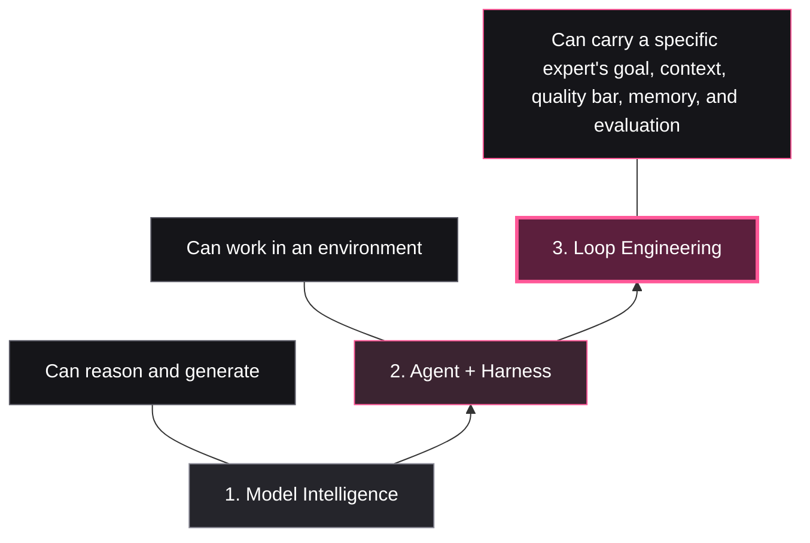
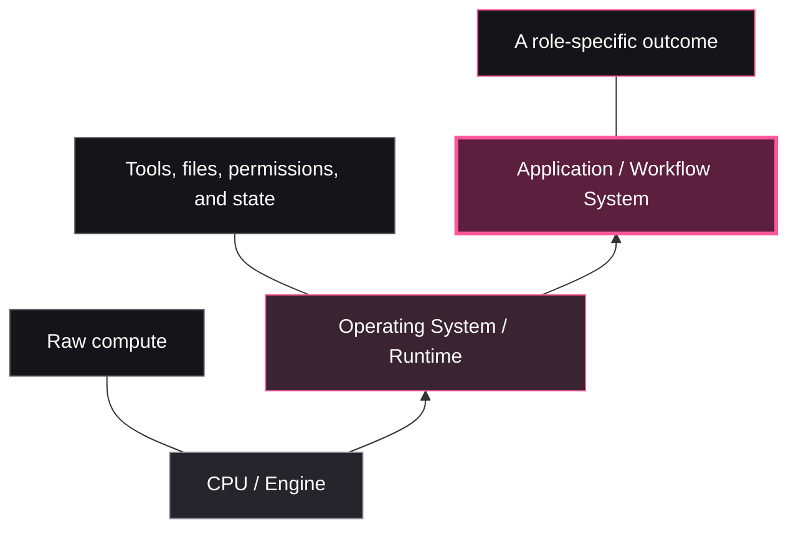

# Beyond Loop Engineering — Presentation Structure

## Main thesis

**Developers are more productive with coding agents—and tired of babysitting them.**

Today, reaching good quality often still means manually prompting, monitoring, correcting, testing, and reviewing each step.

### Why more productive can also mean more drained

For a feature, there may be 100 plausible implementations—but only a few truly fit the codebase, product, architecture, and past decisions.

A coding agent can generate options much faster. The developer still has to identify the right one, review more output, and correct what does not fit. Faster code generation can therefore multiply the decision and review burden.

**Loop engineering** is an emerging term for the system that could move us toward the next stage of autonomy. Its definition is still being discovered through industry experiments and research.

For this presentation, a **loop engineering system** is a goal-driven system that coordinates work toward a verified outcome, then stops.

### What is beginning to emerge

1. **Goal-driven:** define success and stop when the goal is achieved.
2. **Multi-agent:** complex workflows often need specialized agents across planning, building, evaluation, and review.

## Supporting thesis

**Model capability is not autonomy.**



## Computing analogy



## Analogy sources

This is a presentation analogy, not a direct one-to-one technical claim.

- Andrej Karpathy, [LLM OS framing](https://x.com/karpathy/status/1723140519554105733): model / LLM as CPU-like general compute.
- OpenAI, [Harness Engineering](https://openai.com/index/harness-engineering/): the executable system around agents.
- Anthropic, [Effective Context Engineering](https://www.anthropic.com/engineering/effective-context-engineering-for-ai-agents): managing context as a core systems problem.

## The three levels

- **Model intelligence:** can reason and generate.
- **Agent:** can work in an environment.
- **Loop engineering:** can carry a specific expert's goal, context, quality bar, memory, and evaluation toward a verified outcome.

## Our future thesis: workflow infrastructure for autonomy

**The next-generation autonomous agent is not just a better coding agent. It is infrastructure for operating existing agents inside a role-specific workflow.**

AdaL Engineer is our first expression of this idea. For an engineering workflow, it can:
- receive a goal: deliver a PR end-to-end;
- select, prompt, and coordinate existing coding, browser, research, and review agents;
- carry codebase context, company documentation, decisions, and long-term memory;
- enforce safeguards, budgets, permissions, evaluation, and escalation;
- update retained state and documentation as work changes them.

The unit of autonomy is not only an agent. It is a configurable workflow:

```text
existing agents
+ workflow configuration
+ company context and memory
+ safeguards and evaluation
= role-level autonomy
```

Each company or codebase may need a different engineering workflow: different workers, quality gates, documentation, architecture rules, and stop conditions.

Over time, the same pattern could support role-level systems beyond engineering—for example, a designer or video producer—each coordinating capable agents around that expert's workflow and quality bar.

## Near-term goal

> Deliver one task end-to-end at human-level quality.

## Presentation arc

1. Agents are powerful; developers are more productive and more drained.
2. The surprise: model capability is not autonomy.
3. Show the three levels.
4. Define loop engineering as the emerging workflow layer.
5. Present the future thesis: workflow infrastructure for autonomy.
6. Show AdaL Engineer as the first engineering expression of this model.
7. Demo: goal → build → evaluate → fix → evidence.
